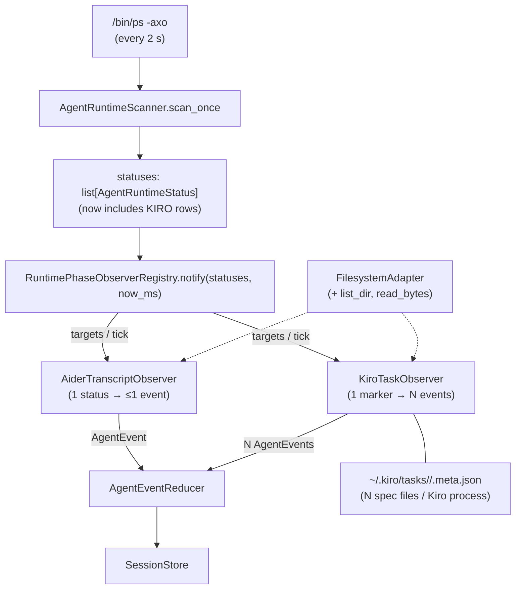
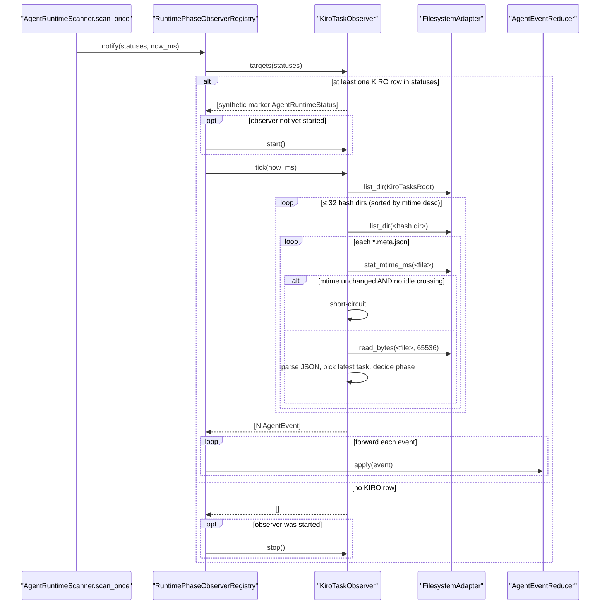
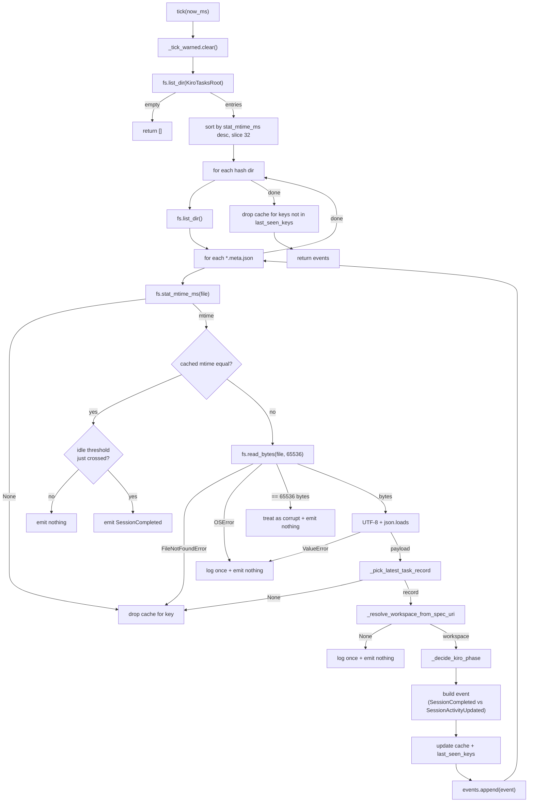

# Design Document

## Overview

The `runtime-phase-observers` framework (delivered, commit `9fbcbba`) gave Deskmate a plug-in seam for elevating passively-discovered runtime rows off the default `RUNNING` phase. Its first concrete observer (`AiderTranscriptObserver`) tails a single transcript file per workspace and emits at most one event per session per tick. That 1:1 cardinality is incidental to Aider's design, not a constraint of the framework.

`KiroTaskObserver` is the framework's first **multi-session-per-source** observer. A single `Kiro.app` process keeps state for an arbitrary number of concurrent specs, each backed by a separate `~/.kiro/tasks/<workspace-hash>/<spec-name>.meta.json` file. The observer fans out a single passive runtime row into N synthetic session events — one per recently-modified spec — keyed by deterministic synthetic ids of the form `runtime-kiro-<hash>-<spec>`.

Two orthogonal pieces ship together:

1. A new `AgentRuntimeSource.KIRO` value plus a `_RUNTIME_PATTERNS` row so the passive scanner discovers the running `Kiro.app` process. This is the trigger signal — without a Kiro process, the observer does no filesystem work.
2. The `KiroTaskObserver` itself, which uses an enriched `FilesystemAdapter` (gaining `list_dir` + `read_bytes`) to enumerate hash directories, parse each spec's metadata, pick the most-recently-updated task, and emit one phase event per spec.

The observer is read-only over the metadata files and emits all phase mutations through the existing `AgentEventReducer`. The reducer's `_preserves_actionable_state` guard keeps protecting `WAITING_FOR_APPROVAL` / `WAITING_FOR_ANSWER`, so a passive Kiro observation can never demote a hook-driven approval row.

The framework's existing crash-isolation, hook-session quarantine, and tick-budget contracts apply unchanged.

## Architecture

### High-level component diagram



The KiroTaskObserver branch is annotated explicitly: it consumes the synthetic marker its own `targets()` returned and produces a fan-out of events. The registry doesn't care about cardinality — it routes events purely by `session_id`, which is exactly what makes the framework able to host this shape without any protocol change.

### Per-tick sequence



The hash-directory bound (32) is enforced inside `tick()` by sorting `list_dir` results by directory mtime and slicing. The bound is global per tick, not per workspace — Kiro's hash collision space is large enough in practice that 32 is a comfortable headroom (the user has one hash dir today; even power users with ~10 different projects stay an order of magnitude below the cap).

## Data Models

### Extension to `AgentRuntimeSource`

```python
class AgentRuntimeSource(StrEnum):
    ...
    KIRO = "kiro"
```

Added at the bottom of the existing enum so wire-format ordering doesn't shift. Default `SessionRow.sourceLabel` Swift fallback already produces `"Kiro"` via the underscore-split title-case path, so no Swift edit is required.

### Extension to `_RUNTIME_PATTERNS`

```python
_RuntimePattern(
    source=AgentRuntimeSource.KIRO,
    kind=AgentRuntimeKind.GUI_IDE,
    display_name="Kiro",
    executables=("kiro",),
    arg_needles=("kiro.app",),
    bundle_id="com.kiro.kiro",  # placeholder; verified at install-time
    helper_needles=("kiro helper", "(renderer)", "(gpu)", "crashpad_handler"),
),
```

Same shape as the Cursor / VSCode rows. Helper needles dedupe Electron renderer subprocesses so the scanner emits a single `KIRO` row per running app instance.

### Extension to `FilesystemAdapter`

```python
@runtime_checkable
class FilesystemAdapter(Protocol):
    def exists(self, path: str) -> bool: ...
    def stat_mtime_ms(self, path: str) -> int | None: ...
    def read_tail(self, path: str, max_bytes: int) -> bytes: ...
    # New methods (Requirement 10.1):
    def list_dir(self, path: str) -> list[str]: ...
    def read_bytes(self, path: str, max_bytes: int) -> bytes: ...
```

`DefaultFilesystemAdapter` adds:

```python
def list_dir(self, path: str) -> list[str]:
    try:
        return os.listdir(path)
    except OSError:
        # Treat any listing failure as "directory is missing" so the
        # observer's bounded scan keeps working without exception
        # plumbing — Requirement 4.4.
        return []

def read_bytes(self, path: str, max_bytes: int) -> bytes:
    with open(path, "rb") as fh:
        return fh.read(max_bytes)
```

The signature stays read-only; the protocol gains zero write surface (Requirement 10.5).

### Per-spec cache shape

```python
@dataclass
class _KiroSpecCacheEntry:
    """V10 kiro-task-observer Requirement 11 — per-(hash, spec)
    state used by the mtime-backoff short-circuit and the idle-
    threshold re-emit edge."""
    mtime_ms: int
    # Last KiroLatestTaskRecord.updatedAt we've seen — re-evaluated
    # on every read to detect idle threshold crossings without
    # forcing a full re-parse on stale files.
    latest_updated_at_ms: int
    # Last phase we emitted — used by Requirement 11.4 to detect
    # the THINKING/RUNNING → COMPLETED transition that has to fire
    # even when the file's mtime did not change.
    last_emitted_phase: SessionPhase
```

The observer's class state is two dictionaries plus a per-tick warning dedup set:

```python
class KiroTaskObserver(RuntimePhaseObserver):
    _cache: dict[tuple[str, str], _KiroSpecCacheEntry]   # (hash_dir, spec_name) → entry
    _last_seen_keys: set[tuple[str, str]]                # for Requirement 11.5 cleanup
    _tick_warned: set[tuple[str, str]]                   # cleared per tick
```

### Synthetic marker status

```python
_KIRO_PIPELINE_STATUS = AgentRuntimeStatus(
    source=AgentRuntimeSource.KIRO,
    kind=AgentRuntimeKind.GUI_IDE,
    display_name="Kiro pipeline marker",
    session_id="runtime-kiro-pipeline",  # locks effective_session_id
)
```

Returned from `targets()` only as a registry-lifecycle marker. The observer never forwards it to the reducer (Requirement 3.5). It exists so the registry can keep its existing "non-empty subset means active, empty means deactivate" lifecycle logic without learning about per-spec keys.

### `_KiroLatestTaskRecord` decision value

```python
@dataclass(frozen=True)
class _KiroLatestTaskRecord:
    task_key: str           # the dictionary key in tasks (used for tiebreaks)
    updated_at_ms: int
    execution_status: str | None
    spec_uri: str | None
```

Pure-value type returned from `_pick_latest_task_record` so the decision tree downstream is a function of plain Python data, not the JSON dict.

## Components and Interfaces

### `_resolve_workspace_from_spec_uri`

```python
def _resolve_workspace_from_spec_uri(
    spec_uri: str | None,
    spec_name: str,
) -> str | None:
    """V10 kiro-task-observer Requirement 6.

    Validates ``spec_uri`` carries the expected
    ``/.kiro/specs/<spec_name>/tasks.md`` suffix and returns the
    parent workspace path. Returns ``None`` for any input that
    can't be unambiguously resolved (missing URI, wrong suffix,
    different spec_name embedded, non-file URI).
    """
    if not spec_uri:
        return None  # Requirement 6.4 (when this is the only record)
    decoded = unquote(spec_uri)
    if decoded.startswith("file://"):
        decoded = decoded[len("file://"):]
    needle = f"/.kiro/specs/{spec_name}/tasks.md"
    if not decoded.endswith(needle):
        return None  # Requirement 6.3
    workspace = decoded[: -len(needle)]
    return workspace or None
```

Edge cases:

- URI with no `file://` prefix is tolerated (Kiro emits it consistently today, but the observer doesn't fail if the prefix is absent).
- Empty workspace (URI is exactly `/.kiro/specs/<spec>/tasks.md`) yields `None` — the spec lives at the filesystem root, which we treat as unresolvable.

### `_pick_latest_task_record`

```python
def _pick_latest_task_record(
    payload: dict,
) -> _KiroLatestTaskRecord | None:
    """Iterates ``payload['tasks']``, drops records lacking a
    valid integer ``updatedAt`` (Requirement 5.6), and returns the
    record with the largest ``updatedAt`` value. Ties broken by
    task key in ascending lexicographic order (Glossary's
    KiroLatestTaskRecord definition)."""
    tasks = payload.get("tasks")
    if not isinstance(tasks, dict) or not tasks:
        return None  # Requirement 5.4 / 5.5
    best: tuple[int, str] | None = None
    chosen: _KiroLatestTaskRecord | None = None
    for key in sorted(tasks):
        record = tasks[key]
        if not isinstance(record, dict):
            continue
        updated = record.get("updatedAt")
        if not isinstance(updated, int):
            continue
        candidate = (updated, key)
        if best is None or candidate > best:
            best = candidate
            chosen = _KiroLatestTaskRecord(
                task_key=key,
                updated_at_ms=updated,
                execution_status=(
                    record.get("executionStatus")
                    if isinstance(record.get("executionStatus"), str)
                    else None
                ),
                spec_uri=(
                    record.get("specUri")
                    if isinstance(record.get("specUri"), str)
                    else None
                ),
            )
    return chosen
```

The lexicographic-tiebreak iteration order is deterministic regardless of dict insertion order, which keeps tests stable.

### `_decide_kiro_phase`

```python
KIRO_IDLE_THRESHOLD_MS: int = 30 * 60 * 1000  # 30 minutes


def _decide_kiro_phase(
    record: _KiroLatestTaskRecord, *, now_ms: int
) -> SessionPhase:
    """V10 kiro-task-observer Requirements 7 + 8."""
    age = now_ms - record.updated_at_ms
    # Requirement 8.1 — idle override wins when the file is past
    # the threshold, regardless of executionStatus.
    if age > KIRO_IDLE_THRESHOLD_MS:
        return SessionPhase.COMPLETED
    # Requirement 8.3 — future-dated mtime falls through to the
    # executionStatus-based path; we don't synthesize "not yet"
    # phases.
    status = record.execution_status
    if status == "succeed":
        return SessionPhase.COMPLETED  # Requirement 7.1
    if status == "in_progress":
        return SessionPhase.THINKING   # Requirement 7.2
    if status == "queued":
        return SessionPhase.RUNNING    # Requirement 7.3
    # Requirement 7.4 / 7.5 — missing or unknown → RUNNING. The
    # warning for "unknown but non-empty" is emitted by the caller
    # so it has access to the synthetic session_id needed for the
    # tick warning dedup key.
    return SessionPhase.RUNNING
```

### Per-tick algorithm (mermaid)



### `KiroTaskObserver.targets`

```python
def targets(
    self, statuses: Sequence[AgentRuntimeStatus]
) -> list[AgentRuntimeStatus]:
    has_kiro = any(
        s.source == AgentRuntimeSource.KIRO for s in statuses
    )
    if not has_kiro:
        return []
    # Requirement 3.1 — a single synthetic status drives the
    # registry's lifecycle. We construct it fresh each tick so
    # tests asserting on identity stay deterministic.
    return [
        AgentRuntimeStatus(
            source=AgentRuntimeSource.KIRO,
            kind=AgentRuntimeKind.GUI_IDE,
            display_name="Kiro pipeline marker",
            session_id="runtime-kiro-pipeline",
        )
    ]
```

### `KiroTaskObserver.tick`

```python
def tick(self, now_ms: int) -> list[AgentEvent]:
    self._tick_warned.clear()
    events: list[AgentEvent] = []
    seen_keys: set[tuple[str, str]] = set()
    hash_dirs = self._scan_hash_dirs()  # Requirement 4
    for hash_name in hash_dirs:
        hash_path = os.path.join(self._kiro_tasks_root, hash_name)
        try:
            entries = self._fs.list_dir(hash_path)
        except OSError:
            continue  # Requirement 4.4
        meta_files = sorted(e for e in entries if e.endswith(".meta.json"))
        for meta_name in meta_files:
            spec_name = meta_name[: -len(".meta.json")]
            key = (hash_name, spec_name)
            seen_keys.add(key)
            event = self._tick_one_meta(hash_path, hash_name, meta_name, spec_name, now_ms)
            if event is not None:
                events.append(event)
    # Requirement 11.5 — drop cache entries for spec files that
    # disappeared so a re-creation triggers a fresh parse instead
    # of short-circuiting on the stale mtime.
    for stale_key in self._last_seen_keys - seen_keys:
        self._cache.pop(stale_key, None)
    self._last_seen_keys = seen_keys
    return events
```

`_tick_one_meta` follows the flowchart above; the mtime backoff with idle-crossing fast path is its core branch:

```python
cached = self._cache.get(key)
if cached is not None and cached.mtime_ms == mtime_ms:
    # Requirement 11.4 — re-emit COMPLETED when the idle threshold
    # crosses since the last tick, even on an unchanged file.
    if cached.last_emitted_phase != SessionPhase.COMPLETED and (
        now_ms - cached.latest_updated_at_ms > KIRO_IDLE_THRESHOLD_MS
    ):
        cached.last_emitted_phase = SessionPhase.COMPLETED
        return _build_kiro_event(
            phase=SessionPhase.COMPLETED,
            session_id=_synthetic_id(hash_name, spec_name),
            workspace=cached.workspace,  # cached on previous parse
            now_ms=now_ms,
        )
    return None
# … else parse, decide, build event, update cache
```

The cache stores the resolved workspace alongside the mtime so the idle-crossing branch can emit without re-parsing. Workspace resolution itself is deterministic given the same `specUri`, but caching it avoids paying the URL-decode + suffix-check on every tick.

## Correctness Properties

### Property 1: Activation gating

When no `AgentRuntimeStatus` in the input has `source == AgentRuntimeSource.KIRO`, the observer's `targets()` returns `[]` and `tick()` performs zero `FilesystemAdapter` calls.

**Validates: Requirements 3.2, 3.4**

### Property 2: Multi-session emission

For N spec meta files spread across one or more hash directories, a single `tick()` returns exactly N events whose `session_id` values are pairwise distinct and equal to `f"runtime-kiro-{hash_name}-{spec_name}"`.

**Validates: Requirements 9.1, 9.5**

### Property 3: Mtime backoff

When `fs.stat_mtime_ms(meta_file)` returns the same value the observer cached on the previous tick AND no idle threshold has just crossed, `fs.read_bytes` is **not** called and the observer emits zero events for that key.

**Validates: Requirements 11.2, 12.2**

### Property 4: Idle threshold override

When `now_ms - latest_updated_at_ms > KiroIdleThresholdMs (1_800_000)`, the observer emits `SessionCompleted` regardless of `executionStatus` and regardless of whether the file's mtime changed since the previous tick.

**Validates: Requirements 8.1, 11.4**

### Property 5: Hash-directory scan bound

Given M candidate hash directories under `KiroTasksRoot` with M > 32, exactly 32 directories are inspected per tick, selected by largest `stat_mtime_ms` with lexicographic tiebreak.

**Validates: Requirements 4.2, 4.3**

### Property 6: Bytes cap

A meta file whose `read_bytes` returned exactly `KiroMetaFileMaxBytes (65_536)` bytes is treated as corrupt: no event is emitted, and the cache is updated to the file's current mtime so we don't keep retrying the same byte sequence (Requirement 13.3).

**Validates: Requirements 5.2, 13.3**

### Property 7: Workspace resolution gate

An event is emitted for a meta file only when `_resolve_workspace_from_spec_uri` returns a non-`None` value. Files whose `specUri` lacks the `/.kiro/specs/<spec_name>/tasks.md` suffix produce zero events.

**Validates: Requirements 6.2, 6.3**

## Error Handling

| Scenario | Detected by | Behavior | Logged |
| --- | --- | --- | --- |
| `KiroTasksRoot` missing | `list_dir` returns `[]` (DefaultFilesystemAdapter swallows OSError) | observer emits zero events for the tick | no |
| Single hash directory unreadable | `list_dir` raises `OSError` (rare path through a non-default fs) | skip that directory only; continue with the rest | no |
| Single hash directory missing | `list_dir` returns `[]` | skip transparently | no |
| Meta file vanished mid-tick | `stat_mtime_ms` returns `None` | drop cache for `(hash, spec)`; emit nothing | no |
| Meta file present but `read_bytes` raises `FileNotFoundError` | observer catches | drop cache; emit nothing | no |
| `read_bytes` raises `OSError` (other) | observer catches | emit nothing | one warning per `(synthetic_session_id, error class)` per tick |
| `read_bytes` returns exactly `max_bytes` | observer compares length to cap | treat as corrupt; cache mtime so we don't loop on it | no |
| UTF-8 decode failure | `bytes.decode("utf-8")` raises | observer catches | one warning per `(hash, spec, error class)` per tick |
| `json.loads` raises `ValueError` | observer catches | observer keeps cached mtime so the same bad bytes aren't re-parsed | one warning per `(hash, spec, error class)` per tick |
| `tasks` key missing or wrong type | `_pick_latest_task_record` returns `None` | emit nothing | no |
| `tasks` is empty dict | `_pick_latest_task_record` returns `None` | emit nothing | no |
| All task records lack `updatedAt` | `_pick_latest_task_record` returns `None` | emit nothing | no |
| `executionStatus` missing | `_decide_kiro_phase` defaults to RUNNING | emit `SessionActivityUpdated(phase=RUNNING)` | no |
| `executionStatus` value unknown (not in succeed/in_progress/queued) | observer logs unknown-status warning | emit `SessionActivityUpdated(phase=RUNNING)` | one warning per `(synthetic_session_id, executionStatus value)` per tick |
| `specUri` missing on every record | `_resolve_workspace_from_spec_uri` returns `None` | emit nothing | one warning per `(hash, spec)` per tick |
| `specUri` doesn't end in `/.kiro/specs/<spec>/tasks.md` | resolver returns `None` | emit nothing | one warning per `(hash, spec)` per tick |
| Future-dated `updatedAt` (`updated_at_ms > now_ms`) | `_decide_kiro_phase` falls through to executionStatus path | normal phase mapping applies; idle override does not fire | no |
| Observer raises in `start` / `stop` / `targets` / `tick` | registry catches | inherits existing crash-isolation contract (`ObserverConsecutiveCrashLimit = 3`) | yes (existing registry warning) |

## Testing Strategy

### Unit tests for pure helpers

`agent/tests/test_runtime_observers.py` (extends the existing file):

- `_resolve_workspace_from_spec_uri`: matched suffix, no `file://` prefix, mismatched spec_name, missing `/.kiro/specs/`, empty workspace, percent-encoded spaces.
- `_pick_latest_task_record`: empty tasks, all records missing `updatedAt`, multiple records with same `updatedAt` (lex tiebreak), records with non-dict values mixed in.
- `_decide_kiro_phase`: each `executionStatus` mapping per Requirement 7, idle override per Requirement 8.1, future-dated `updatedAt` per Requirement 8.3.

### Observer-level unit tests

`KiroTaskObserver` cases:

- **Activation gating** — `targets([])` and `targets([cursor_status])` both return `[]`; `targets([kiro_status])` returns 1-element list with synthetic id.
- **Multi-event emission** — fixture with two hash dirs, three specs total; one `tick(now_ms)` returns three events with distinct `runtime-kiro-<hash>-<spec>` ids.
- **Mtime backoff** — second tick with same mtime emits zero events and asserts `read_bytes` was not called (recording fake adapter).
- **Idle override on cached file** — first tick at 0 ms emits THINKING; second tick at 1 hour later, with same mtime, emits SessionCompleted (Requirement 11.4).
- **Target drop-out cleanup** — spec disappears between ticks; cache for that key is removed (verified by re-introducing the same mtime and confirming a fresh read happens).
- **OSError dedup** — two distinct specs both raise PermissionError on `read_bytes`; one warning per `(synthetic_id, error class)` per tick; second tick with new mtime re-warns (window is per-tick).
- **Bytes cap corrupt** — fake adapter returns exactly 65 536 bytes; emit nothing; cache mtime updated (Requirement 13.3).
- **Hash-dir bound** — fake adapter exposes 50 hash dirs; `tick` reads at most 32, picked by mtime desc; lex tiebreak verified by giving two dirs identical mtime.
- **Workspace resolution gate** — meta file with `specUri` lacking the `/.kiro/specs/<spec>/tasks.md` suffix → no event + warning logged.
- **Future-dated updatedAt** — `updated_at_ms > now_ms` does not idle-override; phase from `executionStatus` is used.
- **Unknown executionStatus** — value `"weird"` → RUNNING + warning.

### Integration tests

`agent/tests/test_runtime_observers_integration.py` (extends the existing file):

- **End-to-end** — real scanner with stub `ps_provider` returning a Kiro process row; fake fs with two hash dirs containing two specs; assert two `SessionInfo` rows in `SessionStore` with phases derived from the meta payload.
- **Property 1 actionable preservation** — pre-seed a session at `WAITING_FOR_APPROVAL` matching one of the synthetic ids; observer's THINKING event must not downgrade it (locked by existing reducer guard widened by `runtime-phase-observers`).
- **Property 5 store isolation** — same explosive-stub-stores trick from `runtime-phase-observers` integration; KiroTaskObserver pipeline completes without touching any store.
- **Tick budget** — fixture with 32 hash dirs each containing one 4 KB meta file; assert `notify` < 50 ms.

### Pre-existing-test preservation

- Existing pytest baseline (current 682) keeps passing.
- Swift smoke (282) keeps passing — no Swift edits.
- Ruff clean.

## Migration Plan

| Step | Change | Risk |
| --- | --- | --- |
| 1 | Add `KIRO = "kiro"` to `AgentRuntimeSource`. | Trivial — additive enum value. |
| 2 | Add the Kiro `_RuntimePattern` row. | Low — exec/args needles are specific enough that no existing process will misclassify. |
| 3 | Extend `FilesystemAdapter` Protocol with `list_dir` and `read_bytes`. | Low — Protocol is `runtime_checkable`; existing observers (`AiderTranscriptObserver`) don't call the new methods, so they don't change. Tests using fake fs adapters get a deprecation-style hint to add the new methods (we'll provide a tiny mixin in tests). |
| 4 | Add `list_dir` + `read_bytes` to `DefaultFilesystemAdapter`. | None — additive, swallows OSError. |
| 5 | Add `KIRO_IDLE_THRESHOLD_MS`, `KIRO_TASK_DIR`, `KIRO_META_MAX_BYTES`, `KIRO_HASH_DIR_LIMIT` constants + `_KiroSpecCacheEntry` + `_KiroLatestTaskRecord` + helper functions to `runtime_observers.py`. | Net-new module surface. |
| 6 | Add `KiroTaskObserver` class to `runtime_observers.py`. | Net-new class. |
| 7 | Update `make_default_registry` to append `KiroTaskObserver(fs=_fs)` after the existing `AiderTranscriptObserver`. | Single line; default observer count goes from 1 to 2. |
| 8 | Add tests in the existing test files. | Net-new tests; baseline unchanged. |

`App._build_app` is untouched (Requirement 15.4). The default observers list grows transparently because the factory is the single registration point.

## Open Questions / Non-goals

- **Kiro `executionStatus` failure sentinel** — the meta-file format does not document a stable failure sentinel today. V1 maps unknown values to RUNNING and logs the unknown value. When Kiro stabilises a failure sentinel, a follow-up spec maps it to `SessionPhase.FAILED`.
- **Per-task progress aggregation** — the meta file carries 30+ task records; V1 emits a single phase derived from the most recently updated task. A future spec could add per-task progress badges to the island compact surface, but that requires a UI design change beyond the runtime observer.
- **`tasks.md` content sniffing for THINKING vs EDITING distinction** — the observer maps `in_progress` to THINKING unconditionally. A follow-up spec could refine this by reading `tasks.md` for the in-progress task's surrounding context (e.g. "if the task description mentions ‘test’, map to TESTING"), but that adds a second file read per tick that V1 deliberately avoids.
- **Hook installer for Kiro** — out of scope. Kiro doesn't expose a documented hook surface today; if it does, a future spec mirrors the Cursor / Claude / Codex installer pattern.
- **Push-based watcher (DispatchSourceFileSystemObject equivalent)** — V1 stays poll-based. A future observer could open a kqueue watch on `~/.kiro/tasks/` and push events into a queue the registry drains, but the existing 2 s scanner cadence is enough for a multi-minute "task transition" UX.
- **Multi-machine sync** — `~/.kiro/tasks/` is local to the running machine. If Kiro starts syncing tasks across devices, this observer needs a presence check to avoid surfacing stale specs for a workspace not currently open.
