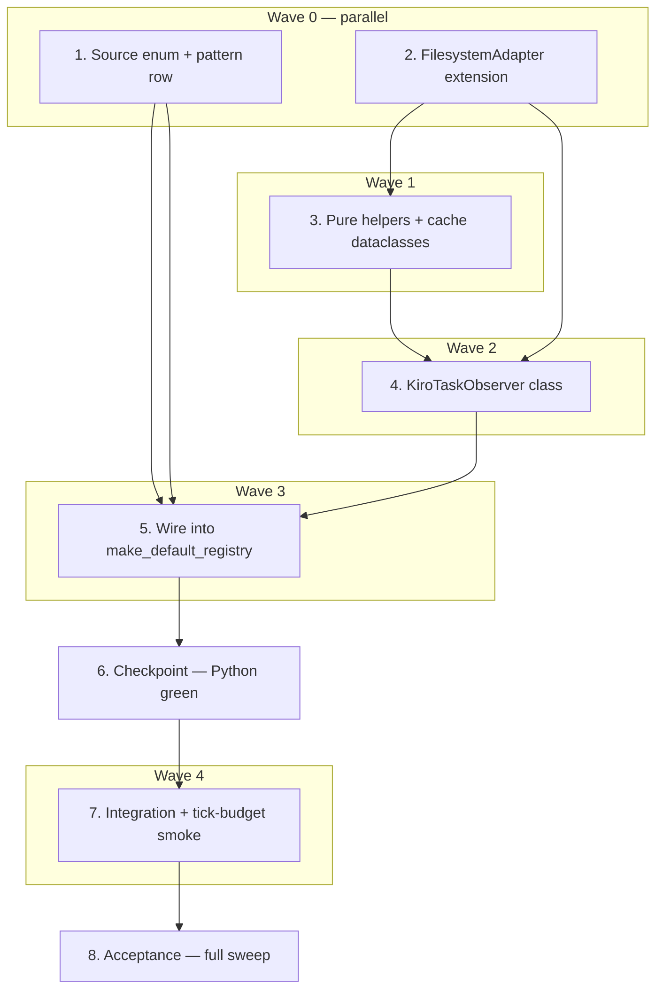

# Implementation Plan: kiro-task-observer

## Overview

This plan turns the `kiro-task-observer` spec into a sequence of compilable, test-green PR-sized batches that implement the design in [design.md](./design.md) against the EARS requirements in [requirements.md](./requirements.md). The migration follows the 8-step plan from `design.md` grouped into six implementation epics plus a checkpoint and acceptance pass: (1) the `AgentRuntimeSource.KIRO` source enum + runtime pattern row, (2) the `FilesystemAdapter` extension with `list_dir` / `read_bytes`, (3) the pure helpers + cache dataclasses, (4) the `KiroTaskObserver` class itself, (5) the `make_default_registry` wiring, and (6/7) integration + tick-budget coverage before final acceptance.

## Introduction

A new `AgentRuntimeSource.KIRO` source drives a multi-session-per-source `KiroTaskObserver` reading `~/.kiro/tasks/<workspace-hash>/<spec-name>.meta.json`. The observer uses an extended `FilesystemAdapter` (gaining `list_dir` + `read_bytes`), short-circuits on `mtime`, bounds its hash-directory scan at 32, and emits one synthetic `AgentEvent` per recently-modified spec keyed `runtime-kiro-<hash>-<spec>`.

Inline implementation only — no subagents. Every code edit lands with comment markers in the form `# Requirement N.M` + `# Locks Property N — <name>` + `# V10 kiro-task-observer …` so traceability survives later refactors. Sub-tasks marked `*` are optional test additions; they ship together with their parent implementation in the same batch. The Python layer is implemented and validated incrementally; no Swift code is modified, so the Swift smoke + build only run once at the final acceptance step.

Baselines: pytest 682 / Swift smoke 282 / `ruff check .` clean.

## Tasks

- [x] 1. Add `AgentRuntimeSource.KIRO` enum value and a `_RUNTIME_PATTERNS` row
  - Edit `agent/deskmate_agent/agent_runtime.py` to add `KIRO = "kiro"` to the `AgentRuntimeSource` StrEnum (append at the end of the enum so wire-format ordering for existing values does not shift).
  - Append a new `_RuntimePattern` row at the end of `_RUNTIME_PATTERNS`: `source=AgentRuntimeSource.KIRO`, `kind=AgentRuntimeKind.GUI_IDE`, `display_name="Kiro"`, `executables=("kiro",)`, `arg_needles=("kiro.app",)`, `bundle_id="com.kiro.kiro"`, `helper_needles=("kiro helper", "(renderer)", "(gpu)", "crashpad_handler")` to dedupe Electron renderer / GPU / crashpad subprocesses.
  - Do NOT modify, remove, or reorder any existing `_RUNTIME_PATTERNS` row.
  - [x]* 1.1 Extend `agent/tests/test_agent_runtime.py` with classifier coverage
    - Foreground `Kiro.app` argv → `AgentRuntimeSource.KIRO` + `AgentRuntimeKind.GUI_IDE`.
    - `Kiro Helper` / `(renderer)` / `(gpu)` / `crashpad_handler` argvs → not classified as a fresh KIRO row (helper-needle dedupe).
    - Existing rows still classify as before (regression).
  - Validation: `.venv/bin/python -m pytest -q` from `agent/` → 682 → ~685; `.venv/bin/python -m ruff check .` from `agent/` → clean.
  - _Requirements: 1.1, 1.2, 1.3, 1.4, 1.5, 1.6_

- [x] 2. Extend `FilesystemAdapter` Protocol and `DefaultFilesystemAdapter` with read-only enumeration + bytes read
  - Edit `agent/deskmate_agent/runtime_observers.py` to add two methods to the `FilesystemAdapter` Protocol: `list_dir(path: str) -> list[str]` and `read_bytes(path: str, max_bytes: int) -> bytes`. Both stay read-only — no write surface is added.
  - Implement `list_dir` on `DefaultFilesystemAdapter` as a thin wrapper around `os.listdir(path)` that swallows `OSError` and returns `[]` so the observer's bounded scan stays exception-free for the missing-root case.
  - Implement `read_bytes` on `DefaultFilesystemAdapter` as `with open(path, "rb") as fh: return fh.read(max_bytes)` — no buffering, no decoding, caller owns the cap.
  - `AiderTranscriptObserver` does not call the new methods, so no behaviour change there.
  - [x]* 2.1 Extend `agent/tests/test_runtime_observers.py` with adapter coverage
    - `DefaultFilesystemAdapter.list_dir` on a missing path returns `[]` (no raise).
    - `DefaultFilesystemAdapter.read_bytes` honours the `max_bytes` cap (file larger than cap → exactly `max_bytes` returned).
    - Protocol conformance: a fake adapter implementing only `exists`/`stat_mtime_ms`/`read_tail`/`list_dir`/`read_bytes` satisfies `isinstance(fake, FilesystemAdapter)` (runtime_checkable still works).
  - Validation: `.venv/bin/python -m pytest -q` from `agent/` → ~685 → ~688; `ruff check .` clean.
  - _Requirements: 10.1, 10.2, 10.5_

- [x] 3. Add pure helpers + cache dataclasses for the observer
  - Edit `agent/deskmate_agent/runtime_observers.py` to add module-level constants (`KIRO_TASKS_ROOT_DEFAULT`, `KIRO_IDLE_THRESHOLD_MS = 30 * 60 * 1000`, `KIRO_META_MAX_BYTES = 65_536`, `KIRO_HASH_DIR_LIMIT = 32`, `KIRO_PIPELINE_SESSION_ID = "runtime-kiro-pipeline"`).
  - Add the frozen dataclass `_KiroLatestTaskRecord(task_key, updated_at_ms, execution_status, spec_uri)`.
  - Add the mutable dataclass `_KiroSpecCacheEntry(mtime_ms, latest_updated_at_ms, last_emitted_phase, workspace)` so the idle-crossing fast path in task 4 can re-emit COMPLETED without re-parsing.
  - Add `_resolve_workspace_from_spec_uri(spec_uri, spec_name)`: `urllib.parse.unquote`, strip leading `file://`, require the suffix `/.kiro/specs/<spec_name>/tasks.md`, return the prefix or `None` (empty workspace also yields `None`).
  - Add `_pick_latest_task_record(payload)`: iterate `payload['tasks']` in `sorted(tasks)` order, drop non-dict values + records lacking an integer `updatedAt`, return the record with the largest `(updated_at_ms, key)` tuple. Lex tiebreak comes for free from the sorted-key iteration.
  - Add `_decide_kiro_phase(record, *, now_ms)`: idle override (`age > KIRO_IDLE_THRESHOLD_MS` → COMPLETED) wins; otherwise `succeed → COMPLETED`, `in_progress → THINKING`, `queued → RUNNING`, missing/unknown → RUNNING. Future-dated `updated_at_ms` falls through to the executionStatus path (no idle override).
  - Add `_synthetic_kiro_session_id(hash_name, spec_name) -> str` returning `f"runtime-kiro-{hash_name}-{spec_name}"`.
  - [x]* 3.1 Add unit tests for `_resolve_workspace_from_spec_uri` in `agent/tests/test_runtime_observers.py`
    - Matched suffix with `file://` prefix; matched suffix without `file://`; mismatched spec_name embedded in URI; missing `/.kiro/specs/`; URI is exactly `/.kiro/specs/<spec>/tasks.md` (empty workspace → `None`); percent-encoded spaces (`%20`) round-tripped through `unquote`.
  - [x]* 3.2 Add unit tests for `_pick_latest_task_record` in `agent/tests/test_runtime_observers.py`
    - Empty `tasks`, `tasks` not a dict, all records missing `updatedAt`, ties broken by lexicographic key, non-dict values mixed with valid records.
  - [x]* 3.3 Add unit tests for `_decide_kiro_phase` in `agent/tests/test_runtime_observers.py`
    - Each Requirement 7 mapping (`succeed`/`in_progress`/`queued`/missing/unknown), Requirement 8.1 idle override beats any executionStatus, Requirement 8.3 future-dated `updated_at_ms` keeps the executionStatus mapping (no idle override).
  - Validation: `.venv/bin/python -m pytest -q` from `agent/` → ~688 → ~698; `ruff check .` clean.
  - _Requirements: 5.4, 5.5, 5.6, 6.1, 6.2, 6.3, 6.4, 6.5, 7.1, 7.2, 7.3, 7.4, 7.5, 8.1, 8.2, 8.3_

- [x] 4. Implement `KiroTaskObserver` class
  - Edit `agent/deskmate_agent/runtime_observers.py` to add `class KiroTaskObserver(RuntimePhaseObserver)` with `__init__(self, *, fs, clock=time.monotonic_ns_to_ms_or_equivalent, kiro_tasks_root=None)`. Default the root to `os.path.expanduser("~/.kiro/tasks")` (the only `os` use is the path expansion at construction time; runtime I/O still flows through `fs`).
  - State: `self._cache: dict[tuple[str, str], _KiroSpecCacheEntry]`, `self._last_seen_keys: set[tuple[str, str]]`, `self._tick_warned: set[tuple[str, str]]`. No threads / asyncio tasks are spawned.
  - `start` and `stop` are no-ops (Requirement 2.5). `start` does not pre-warm the cache.
  - `targets(statuses)`: return `[]` when no input has `source == AgentRuntimeSource.KIRO`. Otherwise return a single `AgentRuntimeStatus(source=KIRO, kind=GUI_IDE, display_name="Kiro pipeline marker", session_id=KIRO_PIPELINE_SESSION_ID)` constructed fresh per call. The marker is never forwarded to `AgentEventReducer.apply` — it only drives the registry's lifecycle.
  - `tick(now_ms)`: clear `self._tick_warned`; `fs.list_dir(self._kiro_tasks_root)`; if empty → return `[]`. Otherwise sort directory entries by `fs.stat_mtime_ms` desc, lex tiebreak ascending, slice to `KIRO_HASH_DIR_LIMIT` (32). For each retained hash dir, `fs.list_dir(<hash_dir>)`; for each child ending in `.meta.json` (sorted ascending), call `_tick_one_meta`. Track every visited `(hash_name, spec_name)` in `seen_keys`. After the loop, drop cache entries whose key is in `self._last_seen_keys - seen_keys`, then assign `self._last_seen_keys = seen_keys`.
  - `_tick_one_meta(hash_path, hash_name, meta_name, spec_name, now_ms)`:
    - `fs.stat_mtime_ms(meta_path)` → `None` means the file vanished mid-tick: drop the cache entry and return `None`.
    - Mtime backoff: if `cached.mtime_ms == mtime_ms`, take the idle-crossing fast path — when `cached.last_emitted_phase != COMPLETED` AND `now_ms - cached.latest_updated_at_ms > KIRO_IDLE_THRESHOLD_MS`, build a `SessionCompleted(session_id=_synthetic_kiro_session_id(...), failed=False, ts_ms=now_ms, source="kiro", cwd=cached.workspace)` event, flip `cached.last_emitted_phase = COMPLETED`, and return it. Otherwise return `None` without calling `read_bytes`.
    - Otherwise call `fs.read_bytes(meta_path, KIRO_META_MAX_BYTES)`; catch `FileNotFoundError` → drop cache entry, return `None`; catch other `OSError` → log one warning per `(synthetic_id, error class)` per tick (use `self._tick_warned`), return `None`.
    - If `len(blob) == KIRO_META_MAX_BYTES` → corrupt-by-truncation: update the cache `mtime_ms` (so we do not loop on the same byte sequence) but emit nothing; the cache `last_emitted_phase` and `workspace` are left untouched.
    - Decode UTF-8 + `json.loads`; on `UnicodeDecodeError`/`json.JSONDecodeError` keep the cache entry populated (Requirement 13.3 — same bytes shouldn't be re-parsed) and emit one warning per `(hash_name, spec_name, error class)` per tick.
    - `_pick_latest_task_record(payload)` → `None` ⇒ no event for this file. `_resolve_workspace_from_spec_uri(record.spec_uri, spec_name)` → `None` ⇒ one warning per `(hash_name, spec_name)` per tick + no event.
    - `phase = _decide_kiro_phase(record, now_ms=now_ms)`. Build `SessionActivityUpdated` for non-COMPLETED phases and `SessionCompleted(failed=False)` for COMPLETED. Set `session_id = _synthetic_kiro_session_id(hash_name, spec_name)`, `source = "kiro"`, `ts_ms = now_ms`, `cwd = workspace`, and populate event metadata so the reducer-driven `SessionInfo.title` becomes `f"Kiro · {spec_name}"` (U+00B7 MIDDLE DOT). Update the cache entry: `mtime_ms`, `latest_updated_at_ms = record.updated_at_ms`, `last_emitted_phase = phase`, `workspace = workspace`. Log the unknown-executionStatus warning here (per `(synthetic_id, executionStatus value)` per tick) so the synthetic id is in scope.
  - Every filesystem read goes through `self._fs`; no `os` / `pathlib` / `open` calls inside `tick`. Path joining uses `os.path.join` only because it is a pure string operation.
  - Export `KiroTaskObserver` from the module's `__all__`.
  - [x]* 4.1 Property-based test for activation gating in `agent/tests/test_runtime_observers.py`
    - **Property 1: Activation gating**
    - **Validates: Requirements 3.2, 3.4**
    - For arbitrary status lists with no KIRO source, `targets(...)` returns `[]` AND a subsequent `tick(now_ms)` performs zero calls on a recording fake `FilesystemAdapter`.
  - [x]* 4.2 Property-based test for multi-session emission in `agent/tests/test_runtime_observers.py`
    - **Property 2: Multi-session emission**
    - **Validates: Requirements 9.1, 9.5**
    - Generate N (1..6) hash dirs with M (1..4) spec meta files each; one `tick(now_ms)` emits exactly N×M events with pairwise distinct `session_id` values matching `runtime-kiro-{hash_name}-{spec_name}`.
  - [x]* 4.3 Property-based test for mtime backoff in `agent/tests/test_runtime_observers.py`
    - **Property 3: Mtime backoff**
    - **Validates: Requirements 11.2, 12.2**
    - Recording fake `FilesystemAdapter`: first tick parses + emits, second tick with identical `stat_mtime_ms` AND `now_ms` not crossing the idle threshold issues zero `read_bytes` calls and emits zero events for that key.
  - [x]* 4.4 Property-based test for idle threshold override in `agent/tests/test_runtime_observers.py`
    - **Property 4: Idle threshold override**
    - **Validates: Requirements 8.1, 11.4**
    - First tick at `t0` emits THINKING (from `in_progress`); second tick at `t0 + 31 min` with the cached file's mtime unchanged emits exactly one `SessionCompleted` for that key (idle-crossing fast path).
  - [x]* 4.5 Property-based test for hash-directory scan bound in `agent/tests/test_runtime_observers.py`
    - **Property 5: Hash-directory scan bound**
    - **Validates: Requirements 4.2, 4.3**
    - Fake adapter exposes 50 hash dirs with monotonically-decreasing `stat_mtime_ms` plus a deliberate tie at the cutoff; `tick` inspects exactly 32 dirs, picked by mtime desc with lex tiebreak.
  - [x]* 4.6 Property-based test for bytes cap corruption in `agent/tests/test_runtime_observers.py`
    - **Property 6: Bytes cap**
    - **Validates: Requirements 5.2, 13.3**
    - Fake adapter returns exactly `KIRO_META_MAX_BYTES` (65 536) bytes for one meta file; `tick` emits zero events for that key, the cache is updated to the new mtime, and a second tick at the same mtime does not re-call `read_bytes`.
  - [x]* 4.7 Property-based test for workspace resolution gate in `agent/tests/test_runtime_observers.py`
    - **Property 7: Workspace resolution gate**
    - **Validates: Requirements 6.2, 6.3**
    - Generate `specUri` strings that either match the `/.kiro/specs/<spec_name>/tasks.md` suffix or fail it; events are emitted iff `_resolve_workspace_from_spec_uri` returns non-`None`, and a warning is logged once per `(hash, spec)` per tick on failure.
  - [x]* 4.8 Targeted unit tests in `agent/tests/test_runtime_observers.py`
    - Cache cleanup on disappearance (Requirement 11.5): re-introduce the same mtime after a gap and assert a fresh `read_bytes` happens.
    - `OSError` (non-`FileNotFoundError`) dedup: two specs raising `PermissionError` on `read_bytes` produce one warning per `(synthetic_id, error class)` per tick; second tick with bumped mtime re-warns.
    - Unknown `executionStatus` value `"weird"` → `RUNNING` + one warning per `(synthetic_id, value)` per tick.
    - Future-dated `updated_at_ms > now_ms` does not trigger the idle override.
  - Validation: `.venv/bin/python -m pytest -q` from `agent/` → ~698 → ~715; `ruff check .` clean.
  - _Requirements: 2.1, 2.2, 2.3, 2.4, 2.5, 2.6, 3.1, 3.2, 3.3, 3.4, 3.5, 4.1, 4.2, 4.3, 4.4, 4.5, 5.1, 5.2, 5.3, 9.1, 9.2, 9.3, 9.4, 9.5, 9.6, 9.7, 10.3, 10.4, 11.1, 11.2, 11.3, 11.4, 11.5, 12.2, 12.3, 13.1, 13.2, 13.3, 13.4, 14.3_

- [x] 5. Wire `KiroTaskObserver` into `make_default_registry`
  - Edit `agent/deskmate_agent/agent_runtime.py` `make_default_registry` factory to append a `KiroTaskObserver(fs=_fs)` instance to the observers list immediately after the existing `AiderTranscriptObserver(fs=_fs)` line. The observer reuses the same `_fs` instance the Aider observer receives.
  - Do NOT add new constructor parameters to `make_default_registry` (signature stays `reducer`, `session_store`, `fs`).
  - Do NOT modify `App._build_app` or any of its call sites.
  - Re-export `KiroTaskObserver` from any module-level `__all__` that already lists `AiderTranscriptObserver` so existing import paths stay symmetric.
  - [x]* 5.1 Extend the existing `make_default_registry` test in `agent/tests/test_runtime_observers.py` (or `test_agent_runtime.py`, wherever the factory is currently asserted)
    - The default observer count rises from 1 to 2; the second observer is a `KiroTaskObserver`; the `KiroTaskObserver._fs` identity matches the `_fs` shared with the Aider observer.
  - Validation: `.venv/bin/python -m pytest -q` from `agent/` → ~715 → ~717; `ruff check .` clean.
  - _Requirements: 15.1, 15.2, 15.3, 15.4_

- [x] 6. Checkpoint — Ensure all Python tests pass
  - Run `.venv/bin/python -m pytest -q` from `agent/` and confirm the count is roughly 682 → ~717 with no failures.
  - Run `.venv/bin/python -m ruff check .` from `agent/` and confirm clean.
  - Ensure all tests pass, ask the user if questions arise.
  - _Requirements: 16.1, 16.3_

- [x] 7. Add end-to-end integration coverage + tick-budget smoke
  - Edit `agent/tests/test_runtime_observers_integration.py` to add three new integration cases that exercise the wired-up registry and reducer (real `AgentRuntimeScanner` with a stubbed `ps_provider`, real `RuntimePhaseObserverRegistry`, real `AgentEventReducer`, fake `FilesystemAdapter`):
    - **End-to-end fan-out**: stub `ps_provider` returns one `Kiro.app` argv; fake fs serves two hash dirs with two specs each (4 total). After one `notify` cycle, `SessionStore` contains four `SessionInfo` rows whose `session_id` values are the four expected `runtime-kiro-*` ids and whose phases match `_decide_kiro_phase` of the per-spec latest record. Titles read `Kiro · <spec-name>`.
    - **Property 1 actionable preservation (P1 lock)**: pre-seed `SessionStore` with one of the synthetic ids at `WAITING_FOR_APPROVAL`. One `notify` cycle that would emit `THINKING` for that key MUST NOT downgrade it — the existing reducer `_preserves_actionable_state` guard still protects the row.
    - **Property 5 store isolation**: reuse the explosive-stub-store helper from the existing `runtime-phase-observers` integration to assert `KiroTaskObserver.tick` does not call any `SessionStore` / `ApprovalStore` / `AgentRuntimeStore` method (all observer phase mutations flow through `AgentEventReducer.apply`).
    - **Tick-budget smoke (Requirement 12.1)**: build a fixture of 32 hash dirs each containing one 4 KiB meta file (gzip-compressible synthetic JSON is fine; size only matters for the read path). Assert one `RuntimePhaseObserverRegistry.notify(...)` call completes in under 50 ms wall-clock. Mark the test `@pytest.mark.timeout(2)` defensively and skip on non-Apple-Silicon CI runners with a `platform.machine()` guard so the assertion doesn't flap on slower hardware (`pytest.skip("tick-budget assertion targets Apple Silicon")`).
  - All four cases live in the existing integration file; no new test module is created.
  - Validation: `.venv/bin/python -m pytest -q` from `agent/` → ~717 → ~721; `ruff check .` clean.
  - _Requirements: 12.1, 14.1, 14.2_

- [x] 8. Acceptance — full regression sweep + manual sanity check
  - Run `.venv/bin/python -m pytest -q` from `agent/` and confirm the final count is ~721 with no failures.
  - Run `.venv/bin/python -m ruff check .` from `agent/` and confirm clean.
  - Run `swift run DeskmateCoreSmoke` from `DeskmateApp/` and confirm the Swift smoke count is unchanged at 282 (regression confirmation only — no Swift code was edited).
  - Run `swift build --product DeskmateMenuBarApp` from `DeskmateApp/` and confirm the menu-bar app still links cleanly.
  - Manual sanity check: open Kiro IDE with at least one active spec (one whose `<spec>.meta.json` has at least one task with `executionStatus == "in_progress"` updated within the last 30 minutes), then start the agent. Confirm the menu-bar island session list shows a `Kiro · <spec-name>` row whose phase reflects the latest task's `executionStatus` (THINKING for `in_progress`, RUNNING for `queued`/missing/unknown, COMPLETED for `succeed` or for any task idle > 30 min). Confirm a second concurrent spec produces a second row with a distinct `runtime-kiro-<hash>-<spec>` id. Confirm closing Kiro stops new rows from appearing on the next 2 s tick.
  - Ensure all tests pass, ask the user if questions arise.
  - _Requirements: 16.1, 16.2, 16.3, 16.4_

## Notes

- Tasks marked with `*` are optional test sub-tasks per the workflow; in this plan they ship together with their parent implementation in the same PR-sized batch so each task ends green.
- Every code edit lands with the tri-marker convention `# Requirement N.M` + `# Locks Property N — <name>` + `# V10 kiro-task-observer …`.
- Properties P1–P7 from `design.md` are encoded as observer-level tests (4.1–4.7); P1 is additionally locked at the integration layer in task 7.
- The hash-directory bound (32) is global per tick. Power users with ~10 active workspaces stay an order of magnitude under the cap.
- The Swift surface is intentionally untouched; the new `kiro` source label is rendered by the existing `SessionRow.sourceLabel` underscore-split title-case fallback as `"Kiro"`.
- The mtime cache stores the resolved workspace alongside `mtime_ms` so the idle-crossing fast path in 4.4 emits `SessionCompleted` without re-parsing the meta file.

## Task Dependency Graph



Tasks 1 and 2 touch disjoint files (`agent_runtime.py` vs `runtime_observers.py`) and are independent — both can land in parallel as Wave 0. Task 3's helpers all live inside `runtime_observers.py` and only need the `FilesystemAdapter` extension from task 2; the per-helper unit tests (3.1, 3.2, 3.3) are themselves independent and can be authored in parallel inside that wave. Task 4 needs both the helpers (task 3) and the adapter extension (task 2). Task 5 wires the new observer into the registry factory and therefore needs both task 1 (source enum) and task 4 (the class). Tasks 7 and 8 are strictly sequential after the checkpoint.

```json
{
  "waves": [
    { "id": 0, "tasks": ["1.1", "2.1"] },
    { "id": 1, "tasks": ["3.1", "3.2", "3.3"] },
    { "id": 2, "tasks": ["4.1", "4.2", "4.3", "4.4", "4.5", "4.6", "4.7", "4.8"] },
    { "id": 3, "tasks": ["5.1"] }
  ]
}
```

The JSON wave block lists only leaf sub-tasks (per workflow rule 9). Top-level parent tasks 1–8 and the checkpoints are scheduled by their parents finishing; the leaf-level dependency layout above mirrors the mermaid graph: adapter-coverage tests (2.1) run alongside the source-enum classifier tests (1.1) in Wave 0, the three pure-helper unit suites run in parallel in Wave 1, all observer-level property and unit tests run in parallel in Wave 2, and the registry-wiring assertion runs alone in Wave 3. Integration coverage (task 7) has no `*` sub-tasks because the integration cases ARE the implementation work for that task.
