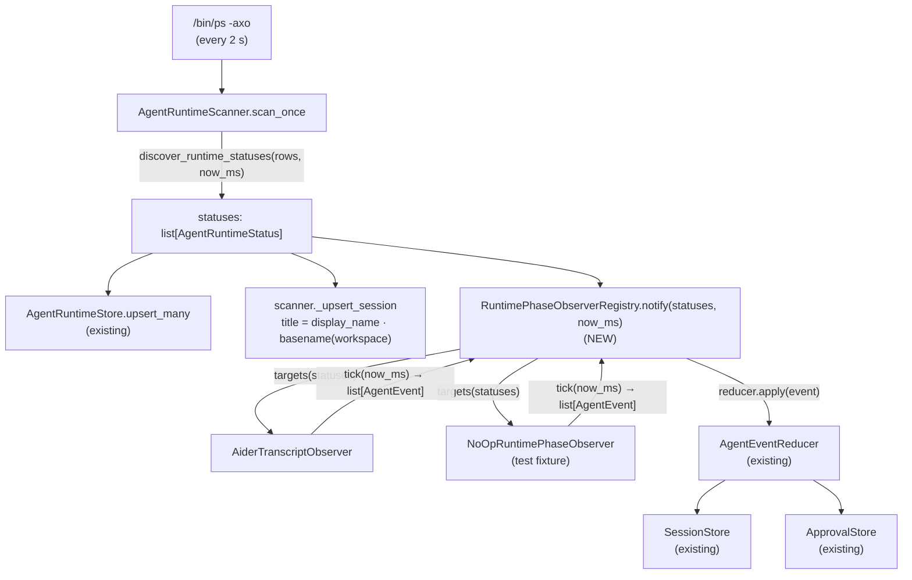
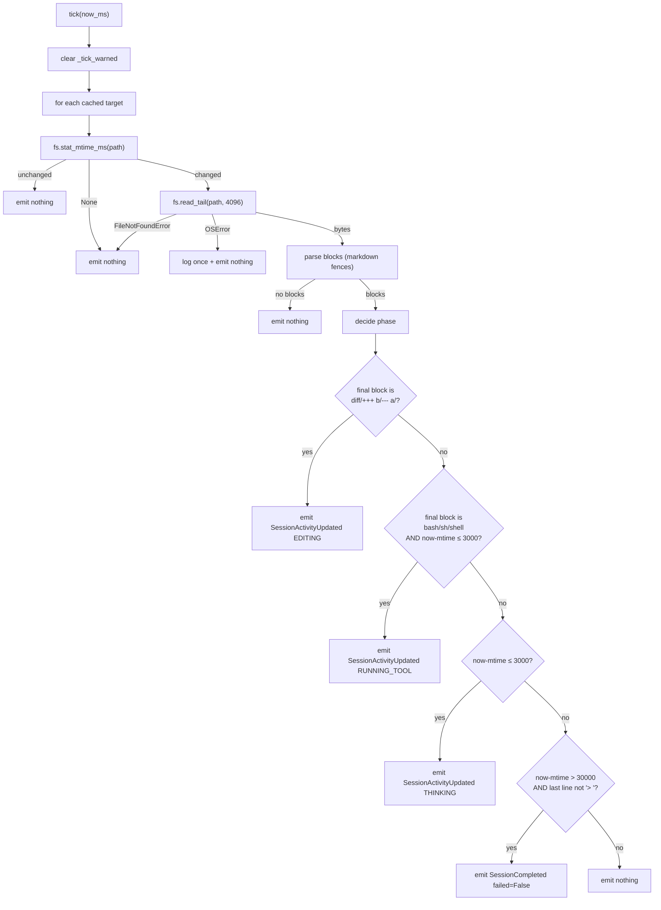

# Design Document

## Overview

Today the menu-bar surface gets fine-grained agent phases (`THINKING`, `EDITING`, `RUNNING_TOOL`, `WAITING_FOR_APPROVAL`, …) only from three privileged paths: hook-installed agents (Codex / Claude Code / Cursor), the Claude JSONL transcript reader, and the Codex App-Server IPC client. Everything that the passive `AgentRuntimeScanner` discovers — Aider, Gemini CLI, Kimi, Qwen, Factory Droid, CodeBuddy, Qoder, Zed, Trae, Sublime, Fleet, Nova, Neovim, GitHub Desktop, Warp, VSCode, Windsurf, JetBrains, Xcode — appears as a perpetually-`RUNNING` row because the scanner has no introspection.

This design extends the scanner with a **plug-in observer framework** that is allowed to elevate a passive row's phase, but only by emitting `AgentEvent`s through the existing `AgentEventReducer`. The framework lands together with one concrete observer (Aider's `.aider.chat.history.md` tailer) so the contract is exercised end-to-end. Subsequent runtimes (Gemini, Kimi, …) reuse the same protocol in follow-up specs.

The design is grounded in three external precedents:

- **MioIsland** — `SessionPhase` Swift enum modelled as an explicit state machine with `canTransition(to:)` validation; `ToolTracker` as the ergonomic shape that aggregates per-session tool runs. We reuse the *idea* of a state-machine boundary; we do not reuse Swift code.
- **MioIsland** — `JSONLInterruptWatcher` with `DispatchSourceFileSystemObject` for sub-100 ms latency. V1 keeps the simpler poll model (the scanner's existing 2 s cadence) so we don't introduce a new event source; the protocol leaves room for a push-based observer in a follow-up.
- **MioIsland** — `SessionState` carrying a `phase: SessionPhase` field exclusively mutated by event reducers. Our `SessionInfo.phase` is the same shape; `AgentEventReducer` is already the choke-point.

The whole feature is additive: existing `parse_ps_output`, `discover_runtime_statuses`, and `AgentRuntimeScanner.scan_once` keep their public signatures. The scanner gains one new dependency (the registry) and one new line in `scan_once`. `AgentRuntimeStatus` gains a single optional field.

## Architecture

### High-level component diagram



The scanner remains the only path that creates / removes session rows. The registry is the only path that may upgrade an already-existing row's `phase` for passive sources. Hook-driven sessions (`SessionInfo.kind == AgentRuntimeKind.HOOK_SESSION`) are filtered out before the registry forwards anything to the reducer, so the existing hook → reducer pipeline keeps full authority over those rows.

### One scan tick — sequence

```mermaid
sequenceDiagram
    participant Loop as "AgentRuntimeScanner._run"
    participant Scan as "scan_once"
    participant Disc as "discover_runtime_statuses"
    participant Store as "AgentRuntimeStore"
    participant Reg as "RuntimePhaseObserverRegistry"
    participant Obs as "RuntimePhaseObserver"
    participant Red as "AgentEventReducer"

    Loop->>Scan: tick
    Scan->>Disc: parse_ps_output → classify → dedupe
    Disc-->>Scan: statuses (with workspace populated)
    Scan->>Store: upsert_many(statuses)
    Scan->>Store: expire(now_ms)
    Scan->>Scan: _upsert_session per status
    Scan->>Reg: notify(statuses, now_ms)
    loop each registered observer
        Reg->>Obs: targets(statuses)
        Obs-->>Reg: subset
        alt subset non-empty
            opt observer not yet started
                Reg->>Obs: start()
            end
            Reg->>Obs: tick(now_ms)
            Obs-->>Reg: events: list[AgentEvent]
            loop each event
                Reg->>Red: apply(event) [skipped if hook session]
            end
        else subset empty
            opt observer was started
                Reg->>Obs: stop()
            end
        end
    end
```

The registry is a synchronous helper. It runs inside the scanner's existing `scan_once` coroutine; observers must finish their work in the same `await` quantum or hand work off (V1 observers do everything in-line because the Aider tail read is < 1 ms).

## Data Models

### `AgentRuntimeStatus.workspace`

A new optional field on the existing Pydantic model.

```python
class AgentRuntimeStatus(BaseModel):
    ...
    workspace: str | None = None
```

Populated by `_build_status` via `WorkspaceRootDetector.detect(row.cwd_or_extracted)`. Keeps the field purely informational — no consumer is required to read it. The scanner uses it to compose a richer session title (Requirement 2.3).

### `FilesystemAdapter` protocol

Read-only seam, so observer tests never touch the host filesystem.

```python
class FilesystemAdapter(Protocol):
    def exists(self, path: str) -> bool: ...
    def stat_mtime_ms(self, path: str) -> int | None: ...
    def read_tail(self, path: str, max_bytes: int) -> bytes: ...
```

`stat_mtime_ms` returns `None` when the file does not exist; raising would force every caller to wrap a try block. `read_tail` is allowed to raise `FileNotFoundError` / `OSError`, which observers catch per Requirement 11.

### `DefaultFilesystemAdapter`

Production implementation.

```python
class DefaultFilesystemAdapter:
    def exists(self, path: str) -> bool:
        return os.path.exists(path)
    def stat_mtime_ms(self, path: str) -> int | None:
        try:
            return int(os.stat(path).st_mtime * 1000)
        except OSError:
            return None
    def read_tail(self, path: str, max_bytes: int) -> bytes:
        with open(path, "rb") as fh:
            try:
                fh.seek(-max_bytes, os.SEEK_END)
            except OSError:
                fh.seek(0)
            return fh.read()
```

The negative-seek trick falls through to a full read when the file is shorter than `max_bytes` (the `OSError` from `seek` covers that case).

### `RuntimePhaseObserver` ABC

```python
class RuntimePhaseObserver(ABC):
    def __init__(
        self,
        *,
        fs: FilesystemAdapter,
        clock: Callable[[], int] = lambda: int(time.time() * 1000),
    ) -> None:
        self._fs = fs
        self._clock = clock

    @abstractmethod
    def start(self) -> None: ...
    @abstractmethod
    def stop(self) -> None: ...
    @abstractmethod
    def targets(
        self, statuses: Sequence[AgentRuntimeStatus]
    ) -> list[AgentRuntimeStatus]: ...
    @abstractmethod
    def tick(self, now_ms: int) -> list[AgentEvent]: ...
```

`tick` does not receive the status list — observers cache the last `targets()` result internally so they can detect drop-outs (Requirement 8.4).

### `RuntimePhaseObserverRegistry` internal state

```python
class RuntimePhaseObserverRegistry:
    def __init__(
        self,
        observers: list[RuntimePhaseObserver],
        reducer: AgentEventReducer,
        session_store_view: Callable[[str], SessionInfo | None],
        # session_store_view is read-only; supplied as a lambda
        # so we can skip events targeting hook sessions without
        # giving observers any store reference.
    ) -> None:
        self._observers = list(observers)
        self._reducer = reducer
        self._session_view = session_store_view
        self._started: set[int] = set()         # id(observer)
        self._crash_count: dict[int, int] = {}  # id(observer) → consecutive failures
        self._disabled: set[int] = set()        # id(observer)
```

The `session_store_view` callable lets the registry resolve `SessionInfo.kind` for the hook-session filter. Observers themselves never see the callable — it lives on the registry.

`_started` keys by `id(obs)` to keep equality semantic out of `RuntimePhaseObserver` (we don't want to require `__eq__`). Since registries are constructed once per scanner, identity is stable.

### `AiderTranscriptObserver` per-session state

```python
class AiderTranscriptObserver(RuntimePhaseObserver):
    def __init__(self, *, fs: FilesystemAdapter, clock=...) -> None:
        super().__init__(fs=fs, clock=clock)
        self._mtime_cache: dict[str, int | None] = {}    # session_id → mtime_ms
        self._last_targets: dict[str, AgentRuntimeStatus] = {}
        self._tick_warned: set[tuple[str, str]] = set()  # cleared per tick
```

`_tick_warned` is reset at the top of every `tick(now_ms)` so the dedup window is one tick wide (Requirement 11.3).

## Components and Interfaces

### `WorkspaceRootDetector`

Pure function, no I/O state, called from `_build_status`.

```python
_WORKSPACE_MARKERS = (
    ".git",
    "pyproject.toml",
    "package.json",
    "Cargo.toml",
    "Package.swift",
)

def detect_workspace_root(
    cwd: str | None,
    *,
    fs_exists: Callable[[str], bool] = os.path.exists,
) -> str | None:
    if not cwd:
        return None
    current = os.path.normpath(cwd)
    deepest_match: str | None = None
    while True:
        try:
            for marker in _WORKSPACE_MARKERS:
                if fs_exists(os.path.join(current, marker)):
                    deepest_match = current
                    break
        except OSError:
            return deepest_match or cwd
        parent = os.path.dirname(current)
        if parent == current:  # filesystem root
            break
        current = parent
    return deepest_match or cwd
```

Walking parent-ward and capturing the **deepest** ancestor satisfies Requirement 1.1 (which says "deepest ancestor including cwd"). Reading "deepest" as "closest to cwd" matches the user-story intent: a monorepo with a top-level `.git` and a sub-project `pyproject.toml` should resolve to the sub-project, not the monorepo root.

Note: the requirement text says "deepest ancestor… that contains a marker". With our walk we keep updating `deepest_match` only when we are still close to `cwd`, then we keep walking. Because we visit closer-to-`cwd` directories first, the **first** match is also the deepest in the tree, so we can short-circuit there:

```python
        parent = os.path.dirname(current)
        if deepest_match is not None:
            return deepest_match
```

The early return preserves spec semantics ("deepest ancestor" = the one nearest `cwd`) and stays under the tick budget on deep paths.

`OSError` aborts the walk and falls back to `deepest_match or cwd` (Requirement 1.5). The `parent == current` check terminates the walk at `/` (Requirement 1.6).

### Title formatting in `_upsert_session`

```python
title = pattern.display_name
if status.workspace:
    leaf = os.path.basename(os.path.normpath(status.workspace))
    if leaf:
        title = f"{pattern.display_name} · {leaf}"
```

Falls back to bare `display_name` when `workspace` is `None` or basename is empty (Requirement 2.4 / 2.5). The basename is taken from the **detected** workspace root, not the raw `cwd`, so a sub-directory inside a project still labels with the project name.

### `RuntimePhaseObserverRegistry.notify`

```python
def notify(
    self, statuses: Sequence[AgentRuntimeStatus], now_ms: int
) -> None:
    for obs in self._observers:
        obs_id = id(obs)
        if obs_id in self._disabled:
            continue
        try:
            subset = obs.targets(statuses)
        except Exception as exc:
            self._record_crash(obs, "targets", exc)
            continue
        if not subset:
            if obs_id in self._started:
                try:
                    obs.stop()
                except Exception as exc:
                    self._record_crash(obs, "stop", exc)
                self._started.discard(obs_id)
            continue
        if obs_id not in self._started:
            try:
                obs.start()
            except Exception as exc:
                self._record_crash(obs, "start", exc)
                continue  # leave un-started, retry next tick
            self._started.add(obs_id)
        try:
            events = obs.tick(now_ms)
        except Exception as exc:
            self._record_crash(obs, "tick", exc)
            continue
        # Successful tick clears the consecutive-crash counter so a
        # transient hiccup never accumulates toward the disable
        # threshold.
        self._crash_count.pop(obs_id, None)
        for event in events:
            session = self._session_view(event.session_id)
            if session is not None and session.kind == AgentRuntimeKind.HOOK_SESSION.value:
                continue  # Requirement 5.6
            self._reducer.apply(event)

def _record_crash(self, obs, where: str, exc: Exception) -> None:
    obs_id = id(obs)
    n = self._crash_count.get(obs_id, 0) + 1
    self._crash_count[obs_id] = n
    _LOG.warning(
        "runtime_observer.failed",
        observer=type(obs).__name__,
        where=where,
        error=type(exc).__name__,
        consecutive=n,
    )
    if n >= 3:
        self._disabled.add(obs_id)
        _LOG.warning(
            "runtime_observer.disabled",
            observer=type(obs).__name__,
            after=n,
        )
```

The `start()` failure path leaves the observer un-started (Requirement 12.3) so the next eligible tick retries. `stop()` failures still mark the observer as no-longer-started so we don't keep calling `stop` on a corrupt observer.

### `AiderTranscriptObserver.tick` — phase decision tree



Priority order is enforced by the early-return cascade — once a branch emits an event for a target, the next target starts evaluation. Only one event per `(session, tick)` (Requirement 7.5).

The 3-30 s no-mans-land between RUNNING-but-quiet (Aider waiting on the LLM) and idle deliberately emits nothing: we don't want to flap COMPLETED at 4 s only to bounce back to THINKING when the next token arrives. The reducer keeps the last-known phase.

### Markdown fence parser

Aider transcripts are markdown with conventional ` ``` ` fences. The parser is tiny:

```python
def _last_fenced_block(tail: bytes) -> tuple[str, str] | None:
    """Return (info_string, body) of the final fenced block, or None.

    Tolerates an unclosed trailing fence by ignoring it: the highest
    block we return is always paired ``` … ```.
    """
    text = tail.decode("utf-8", errors="replace")
    lines = text.splitlines()
    blocks: list[tuple[str, list[str]]] = []
    info: str | None = None
    body: list[str] = []
    for line in lines:
        stripped = line.lstrip()
        if stripped.startswith("```"):
            if info is None:
                info = stripped[3:].strip().lower()
                body = []
            else:
                blocks.append((info, body))
                info = None
                body = []
        elif info is not None:
            body.append(line)
    if not blocks:
        return None
    info_str, body_lines = blocks[-1]
    return info_str, "\n".join(body_lines)
```

If the final fence in the tail is unclosed (`info is not None` at end of input), the loop simply doesn't append it — the unclosed block is invisible (Requirement 11.5). Decoding with `errors="replace"` keeps a partial UTF-8 byte sequence at the start of the tail from raising.

### `AiderTranscriptObserver.tick` body

```python
def tick(self, now_ms: int) -> list[AgentEvent]:
    self._tick_warned.clear()
    events: list[AgentEvent] = []
    for sid, status in list(self._last_targets.items()):
        path = os.path.join(status.workspace, ".aider.chat.history.md")
        if not self._fs.exists(path):
            self._mtime_cache.pop(sid, None)
            continue
        mtime = self._fs.stat_mtime_ms(path)
        if mtime is None:
            self._mtime_cache.pop(sid, None)
            continue
        cached = self._mtime_cache.get(sid)
        if cached is not None and cached == mtime:
            continue  # Requirement 8.2
        self._mtime_cache[sid] = mtime
        try:
            tail = self._fs.read_tail(path, 4096)
        except FileNotFoundError:
            continue
        except OSError as exc:
            key = (sid, type(exc).__name__)
            if key not in self._tick_warned:
                _LOG.warning(
                    "aider_observer.read_failed",
                    session_id=sid,
                    error=type(exc).__name__,
                )
                self._tick_warned.add(key)
            continue
        decision = _decide_aider_phase(
            tail, mtime_ms=mtime, now_ms=now_ms
        )
        if decision is None:
            continue
        events.append(_build_aider_event(decision, status, now_ms))
    return events
```

### `targets()` for Aider

```python
def targets(self, statuses):
    selected = [
        s for s in statuses
        if s.source == AgentRuntimeSource.AIDER and s.workspace
    ]
    seen_ids = {s.effective_session_id for s in selected}
    # Requirement 8.4: drop mtime cache for sessions that disappeared.
    for stale in [sid for sid in self._last_targets if sid not in seen_ids]:
        self._mtime_cache.pop(stale, None)
        del self._last_targets[stale]
    self._last_targets = {s.effective_session_id: s for s in selected}
    return selected
```

### `NoOpRuntimePhaseObserver`

```python
class NoOpRuntimePhaseObserver(RuntimePhaseObserver):
    def __init__(self, *, fs=None, clock=lambda: 0) -> None:
        super().__init__(
            fs=fs or DefaultFilesystemAdapter(),
            clock=clock,
        )
        self.start_calls = 0
        self.stop_calls = 0
        self.targets_calls = 0
        self.tick_calls = 0

    def start(self) -> None: self.start_calls += 1
    def stop(self) -> None: self.stop_calls += 1
    def targets(self, statuses): self.targets_calls += 1; return []
    def tick(self, now_ms): self.tick_calls += 1; return []
```

The default `targets` returns `[]` so the registry never starts the observer. Tests that need to exercise `start` / `tick` lifecycle subclass `NoOpRuntimePhaseObserver` and override `targets`.

## Correctness Properties

The spec doesn't require Hypothesis-driven PBT; we encode the same intent as plain pytest assertions. Each property is named so the design matches the test list 1:1.

### Property 1: actionable phase preservation

For any `SessionInfo` with `phase ∈ {WAITING_FOR_APPROVAL, WAITING_FOR_ANSWER}`, after the registry forwards `SessionActivityUpdated(phase=RUNNING)` for that session, the resulting `SessionInfo.phase` is unchanged. Falls out of `_preserves_actionable_state` in `agent_events.py` (Requirement 5.4).

**Validates: Requirements 5.4**

### Property 2: event ordering

Events are forwarded to the reducer in the order: observers in registration order, then within an observer in `tick()` return order. Locked by the registry's per-observer for-loop (Requirement 4.7).

**Validates: Requirements 4.7**

### Property 3: hook-session quarantine

The registry never invokes `reducer.apply` for a session whose `SessionInfo.kind == HOOK_SESSION`. Locked by the `_session_view` filter (Requirement 5.6).

**Validates: Requirements 5.6**

### Property 4: three-strike disable

After `ObserverConsecutiveCrashLimit = 3` consecutive exceptions in `start` / `stop` / `targets` / `tick`, the registry stops invoking the observer for the rest of its lifetime. A successful `tick` resets the counter (Requirement 12.4).

**Validates: Requirements 12.4**

### Property 5: store isolation

No observer call reads or writes `SessionStore`, `ApprovalStore`, or `AgentRuntimeStore`. Verified by an integration test that wires the registry with stub stores whose every method raises `AssertionError` if invoked (Requirement 5.3).

**Validates: Requirements 5.3**

### Property 6: mtime backoff

When `fs.stat_mtime_ms(path)` returns the same value the observer cached on the previous tick, `fs.read_tail` is **not** called and the observer emits zero events for that session (Requirement 8.2 / 9.2).

**Validates: Requirements 8.2, 9.2**

### Property 7: at-most-one event per (session, tick)

For any session, a single `tick(now_ms)` returns at most one event with that `session_id`. Locked by the cascade in `_decide_aider_phase` (Requirement 7.5).

**Validates: Requirements 7.5**

## Error Handling

| Scenario | Detected by | Behavior | Logged |
| --- | --- | --- | --- |
| Aider transcript missing | `fs.exists(path) == False` | drop mtime cache; emit nothing | no |
| Aider transcript vanished mid-tick | `read_tail` raises `FileNotFoundError` | emit nothing | no |
| Aider transcript permission / I/O error | `read_tail` raises non-`FileNotFoundError` `OSError` | emit nothing | one warning per (`session_id`, error class) per tick |
| Aider tail has no parseable block | `_last_fenced_block` returns `None` | emit nothing | no |
| Aider tail has unclosed trailing fence | parser ignores trailing block | use last fully-closed block | no |
| `WorkspaceRootDetector` hits unreadable ancestor | `OSError` during `os.path.exists` | abort walk, fall back to `cwd` | no (silent — happens on disk-full or similar boundary) |
| Observer raises in `targets` | registry catches | log warning + increment crash counter | yes |
| Observer raises in `start` | registry catches | log warning, leave un-started, retry next tick | yes |
| Observer raises in `stop` | registry catches | log warning, mark un-started anyway | yes |
| Observer raises in `tick` | registry catches | discard partial events, log warning, increment counter | yes |
| Observer hits 3-strike | crash counter reaches 3 | observer placed in `_disabled`, never called again | yes (one summary warning) |

## Testing Strategy

### Unit tests (`agent/tests/test_runtime_observers.py` — new)

Workspace detection (Requirement 1):
- `.git` at `cwd` → returns `cwd`.
- `pyproject.toml` two levels up → returns the matching ancestor.
- nested project: outer `.git`, inner `pyproject.toml` → inner wins.
- no marker found → returns `cwd`.
- `cwd is None` → returns `None`.
- `OSError` from `fs_exists` → returns deepest match seen so far, else `cwd`.
- walk terminates at `/` and never recurses.

Title formatting in `_upsert_session` (Requirement 2):
- `workspace = "/Users/dev/projects/deskmate"` → title `Aider · deskmate`.
- `workspace = None` → title `Aider`.
- `workspace = "/"` → basename is empty → title `Aider`.

`AiderTranscriptObserver` (Requirements 6-8, 11):
- targets filter: only `source == AIDER` AND `workspace != None` survive.
- mtime cache hit short-circuits `read_tail`.
- mtime change drops cache; subsequent tick reads tail.
- target drop-out clears cache (so re-discovery re-reads).
- file missing → no event.
- final block ` ```diff `+ within 30 s → EDITING.
- final block `+++ b/foo` lines + within 30 s → EDITING (sniff diff fence by body too).
- final block ` ```bash ` + mtime within 3 s → RUNNING_TOOL.
- final block ` ```bash ` + mtime older than 3 s → no event (between 3-30 s) **OR** COMPLETED (> 30 s).
- non-fence text + mtime within 3 s → THINKING.
- mtime > 30 s with non-`> ` last line → COMPLETED.
- mtime > 30 s with `> user prompt` last line → no event (user is composing).
- multiple matching conditions: priority test asserts EDITING > RUNNING_TOOL > THINKING > COMPLETED.
- malformed unclosed fence → falls back to last good block.
- `read_tail` raising `FileNotFoundError` → no event, no log.
- `read_tail` raising other `OSError` → no event + one warning per (session, error class) per tick.
- two crashes in two ticks log twice (deduper is per-tick, not per-session-lifetime).

`RuntimePhaseObserverRegistry` (Requirements 4, 5, 12):
- empty observers → `notify` is a no-op.
- subset non-empty → `start()` called once across multiple ticks.
- subset empty after non-empty → `stop()` called.
- `start()` raises → observer remains un-started; next eligible tick retries.
- `stop()` raises → observer marked un-started anyway.
- `tick()` returns events → forwarded to reducer in returned order.
- two observers with overlapping events → forwarded in observer registration order, then each observer's internal order.
- 3 consecutive crashes → observer disabled; further ticks skip.
- successful tick after crash → counter resets (4-strike scenario where a success at strike 2 keeps the observer alive).
- hook-session filter: event with `session_id` whose `SessionInfo.kind == HOOK_SESSION` is dropped.

### Integration test (`agent/tests/test_runtime_observers_integration.py` — new)

- Wire `AgentRuntimeScanner` with stub `ps_provider` returning one Aider row.
- Inject a fake `FilesystemAdapter` whose tail content drives a known phase decision.
- Assert that after one `scan_once`, `SessionStore.get(session_id).phase` matches the expected `SessionPhase`.
- Assert `AgentRuntimeStore` was not touched by the observer (`assertion stub` integration: pass an `AgentRuntimeStore` whose `upsert_many` raises if called from outside the scanner).

### Existing-suite preservation (Requirement 14)

- Existing 625 pytest tests + 282 Swift smoke cases keep passing.
- New tests target ≥ 15 cases to stay under "review fatigue" but cover every Requirement clause that admits a unit test.

## Migration Plan

| Step | Change | Risk |
| --- | --- | --- |
| 1 | Add `workspace: str | None = None` field to `AgentRuntimeStatus`. | Trivial — `extra="allow"` in the model means downstream consumers ignore unknown fields anyway. |
| 2 | Add `WorkspaceRootDetector` (pure function) and call it inside `_build_status`. | None — output is an additional field. |
| 3 | Update `_upsert_session` title composition to use `workspace`. | Low — existing test `test_scanner_creates_and_expires_fallback_sessions` asserts against the bare title; we'll update it to read the new format. |
| 4 | Create `agent/deskmate_agent/runtime_observers.py` with protocol, defaults, registry, and Aider observer. | Net-new module. |
| 5 | Wire `RuntimePhaseObserverRegistry` into `AgentRuntimeScanner` (default empty). | One new constructor arg with a default `None` so existing callers don't change. |
| 6 | Inside `scan_once`, after `_upsert_session` loop, call `self._registry.notify(statuses, now_ms)` if registry is set. | Single line, behind a guard. |
| 7 | Construct the registry where the scanner is constructed in `app.py` (`_build_app`), passing the Aider observer. | Keeps `App._build_app` unchanged — a one-line addition where the scanner is already built. |

`App._build_app()` itself is not restructured — the requirement says "shall not be constructed by `App._build_app()`". We satisfy this by having `agent_runtime.py` expose a `make_default_registry(...)` factory that `_build_app` calls; the registry is owned by the scanner, not by `_build_app`.

```python
# agent_runtime.py
def make_default_registry(
    reducer: AgentEventReducer,
    session_store: SessionStore,
    fs: FilesystemAdapter | None = None,
) -> RuntimePhaseObserverRegistry:
    fs = fs or DefaultFilesystemAdapter()
    return RuntimePhaseObserverRegistry(
        observers=[AiderTranscriptObserver(fs=fs)],
        reducer=reducer,
        session_store_view=session_store.get,
    )
```

`session_store.get` is the only callable handed to the registry, and it's used solely for the hook-session filter.

## Open Questions / Non-goals

- **Push-based watcher.** V1 polls inside the scanner's existing 2 s loop. A `DispatchSourceFileSystemObject`-style observer (à la MioIsland's `JSONLInterruptWatcher`) is intentionally deferred — the protocol allows it without breaking changes (an observer that owns its own asyncio task can simply return `[]` from `tick` and emit events through a queue the registry drains, in a follow-up).
- **Concrete observers for Gemini / Kimi / Qwen / Factory Droid / CodeBuddy / Qoder / VSCode / Windsurf / Zed / Trae / etc.** Each is a follow-up spec that adds one observer class and one `_RUNTIME_PATTERNS`-level wiring change. The framework deliberately ships with one concrete implementation so review pressure stays focused on the contract, not on a long catalogue of best-effort heuristics.
- **Hook installer for Aider.** Out of scope. Aider has no plug-in surface today; the file-tailer is the right shape.
- **State-machine validation à la MioIsland's `canTransition`.** The reducer's `_preserves_actionable_state` already handles the only transition we care about (don't downgrade from waiting). A full transition matrix is unnecessary because the reducer is the choke-point and the observer surface is restricted to "emit a phase, reducer decides".
- **Swift-side surfacing.** Existing `SessionRow.phaseLabel` already renders all `SessionPhase` values. No Swift changes needed. (A future polish — animating phase changes in the island — is decoupled from this spec.)
