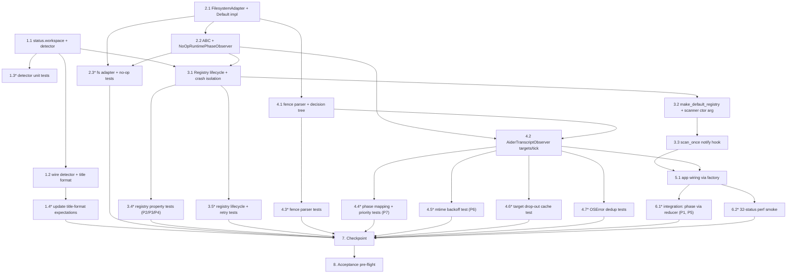

# Implementation Plan: Runtime Phase Observers

## Introduction

This plan turns the design in `.kiro/specs/runtime-phase-observers/design.md` (correctness properties P1–P7, error matrix, 7-step migration plan) into PR-sized batches that satisfy the 14 EARS requirements in `.kiro/specs/runtime-phase-observers/requirements.md`. Each task ships a compilable agent + green pytest baseline; testing sub-tasks are marked optional (`*`) but should land with the implementation they cover so properties stay locked at the same commit.

## Overview

Six implementation epics deliver the design in dependency order: (1) `WorkspaceRootDetector` + `AgentRuntimeStatus.workspace` + title formatting, (2) the observer-module skeleton with the `FilesystemAdapter` seam and `NoOpRuntimePhaseObserver`, (3) `RuntimePhaseObserverRegistry` plus its scanner wiring, (4) `AiderTranscriptObserver`, (5) the `make_default_registry` call from `app.py`, and (6) integration + tick-budget smoke. Two checkpoint tasks (7, 8) gate the merge: a mid-flight pytest/ruff sanity stop and a final acceptance pre-flight that also exercises Swift smoke + the menu-bar build to confirm Requirement 14.4 (no Swift surface modified).

## Conventions

- Inline implementation only — no subagents.
- Every new symbol carries a docstring header and inline comments tagging the EARS clauses it implements (e.g. `# Requirement 1.1`, `# V10 deepest-marker walk`) and, where relevant, the design property it locks (`# Locks Property 6 — mtime backoff`).
- "pytest count delta" assumes the pre-feature baseline of 625 tests (Requirement 14.1). The Swift smoke baseline is 282 cases (Requirement 14.2).
- Python validation: `.venv/bin/python -m pytest -q` and `.venv/bin/python -m ruff check .` from `agent/`.
- Swift validation (only Task 1 and Task 7): `swift run DeskmateCoreSmoke` and `swift build --product DeskmateMenuBarApp` from `DeskmateApp/`.

## Task Dependency Graph



Independent leaves the graph deliberately keeps unblocked once their parents are done:
- **4.4* Aider phase mapping** and **3.4* registry property tests** can be authored in parallel — they touch disjoint files and disjoint code paths.
- **3.5* lifecycle tests** and **4.5*/4.6*/4.7* observer micro-tests** are also parallelisable.

The same graph expressed as scheduling waves for the workflow's parallel runner (only leaf sub-tasks are listed; checkpoints and bare epics are excluded):

```json
{
  "waves": [
    { "id": 0, "tasks": ["1.1", "2.1"] },
    { "id": 1, "tasks": ["1.2", "1.3", "2.2"] },
    { "id": 2, "tasks": ["1.4", "2.3", "3.1", "4.1"] },
    { "id": 3, "tasks": ["3.2", "3.4", "3.5", "4.2", "4.3"] },
    { "id": 4, "tasks": ["3.3", "4.4", "4.5", "4.6", "4.7"] },
    { "id": 5, "tasks": ["5.1"] },
    { "id": 6, "tasks": ["6.1", "6.2"] }
  ]
}
```

## Tasks

- [x] 1. Surface `workspace` on `AgentRuntimeStatus` and use it in session titles
  - [x] 1.1 Add `workspace: str | None = None` field and `WorkspaceRootDetector`
    - File: `agent/deskmate_agent/agent_runtime.py` — extend the Pydantic model with the new optional field; add a module-level `_WORKSPACE_MARKERS` tuple matching the design's exhaustive list; add `detect_workspace_root(cwd, *, fs_exists=os.path.exists)` as a pure function with the deepest-match early-return optimisation from the design.
    - Comment markers: `# Requirement 1.1` … `# Requirement 1.6`, `# Requirement 2.1`, `# V10 deepest-marker short-circuit`.
    - Validation: `.venv/bin/python -m pytest -q agent/tests/test_agent_runtime.py` (no behaviour change yet — pytest 625 → 625), `.venv/bin/python -m ruff check .`.
    - Requirements: 1.1, 1.2, 1.3, 1.4, 1.5, 1.6, 2.1.

  - [x] 1.2 Populate `workspace` in `_build_status` and reformat `_upsert_session` titles
    - File: `agent/deskmate_agent/agent_runtime.py` — call `detect_workspace_root(row.cwd_or_extracted)` inside `_build_status` and assign the result; in `_upsert_session`, compute `leaf = os.path.basename(os.path.normpath(status.workspace))` and set `title = f"{pattern.display_name} · {leaf}"` only when `status.workspace` is non-`None` and `leaf` is non-empty, else fall back to `pattern.display_name`.
    - Comment markers: `# Requirement 2.2`, `# Requirement 2.3`, `# Requirement 2.4`, `# Requirement 2.5`, `# Requirement 2.6 — no enum or pattern mutation`.
    - Validation: `.venv/bin/python -m pytest -q agent/tests/test_agent_runtime.py` (will fail until 1.4 updates expectations — that is intentional within this batch).
    - Requirements: 2.2, 2.3, 2.4, 2.5, 2.6.

  - [x]* 1.3 Unit tests for `WorkspaceRootDetector`
    - File: `agent/tests/test_runtime_observers.py` (new) — cases mirroring the design's testing strategy: `.git` at `cwd`, `pyproject.toml` two levels up, nested project (outer `.git` + inner `pyproject.toml` → inner wins), no marker → returns `cwd`, `cwd is None` → returns `None`, `OSError` from injected `fs_exists` → returns deepest match seen so far else `cwd`, walk terminates at `/` without infinite recursion.
    - Validation: pytest 625 → ~635, `.venv/bin/python -m ruff check .`.
    - Requirements: 1.1, 1.2, 1.3, 1.4, 1.5, 1.6.

  - [x]* 1.4 Update existing `_upsert_session` expectations
    - File: `agent/tests/test_agent_runtime.py` — adjust `test_scanner_creates_and_expires_fallback_sessions` (and any sibling case asserting on bare `display_name`) to expect `"<display_name> · <basename>"` for fixtures whose `cwd` matches a marker; add new cases for the `workspace = None`, `workspace = "/"` (empty basename), and "marker not found, fall back to cwd basename" paths.
    - Validation: pytest ~635 → ~640.
    - Requirements: 2.3, 2.4, 2.5.

- [x] 2. Land the observer module skeleton
  - [x] 2.1 Create `runtime_observers.py` with the filesystem seam
    - File: `agent/deskmate_agent/runtime_observers.py` (new) — define the `FilesystemAdapter` `Protocol` (`exists`, `stat_mtime_ms`, `read_tail`; no write surface) and the `DefaultFilesystemAdapter` backed by `os.path.exists` / `os.stat` / a negative-`SEEK_END` tail read that falls back to `seek(0)` on `OSError`. Module imports must stay within `agent/pyproject.toml`'s declared deps and must not import `asyncio.create_task` or `subprocess`.
    - Comment markers: `# Requirement 10.1`, `# Requirement 10.3`, `# Requirement 3.7 — import surface allow-list`.
    - Validation: `.venv/bin/python -m pytest -q` (pytest 640 → 640), `.venv/bin/python -m ruff check .`.
    - Requirements: 3.7, 10.1, 10.3.

  - [x] 2.2 Add `RuntimePhaseObserver` ABC and `NoOpRuntimePhaseObserver`
    - File: `agent/deskmate_agent/runtime_observers.py` — define the ABC with `start()`, `stop()`, `targets(statuses)`, `tick(now_ms)` abstract methods, the keyword-only constructor accepting `fs: FilesystemAdapter` and a `clock: Callable[[], int]`, and the read-only `_fs` / `_clock` attributes; add `NoOpRuntimePhaseObserver` exposing the four `*_calls` integer counters and returning `[]` from both `targets` and `tick`.
    - Comment markers: `# Requirement 3.1` … `# Requirement 3.6`, `# Requirement 13.1` … `# Requirement 13.4`.
    - Validation: pytest 640 → 640, ruff clean.
    - Requirements: 3.1, 3.2, 3.3, 3.4, 3.5, 3.6, 13.1, 13.2, 13.3, 13.4.

  - [x]* 2.3 Tests for the seam and the no-op observer
    - File: `agent/tests/test_runtime_observers.py` — `DefaultFilesystemAdapter`: `stat_mtime_ms` returns `None` on missing path; `read_tail` returns last `max_bytes` bytes for a long file and the whole file when shorter than `max_bytes`. `NoOpRuntimePhaseObserver`: each method increments its respective counter exactly once per call; `targets`/`tick` return `[]`.
    - Validation: pytest ~640 → ~645.
    - Requirements: 10.1, 10.3, 13.1, 13.2, 13.3, 13.4.

- [x] 3. Build the registry and wire it into the scanner
  - [x] 3.1 Implement `RuntimePhaseObserverRegistry`
    - File: `agent/deskmate_agent/runtime_observers.py` — `notify(statuses, now_ms)` runs the per-observer cascade exactly as the design pseudocode prescribes: skip disabled, call `targets`, drop empty subsets to `stop()` if started, lazy-`start()` on first non-empty subset, `tick()`, clear per-observer crash counter on success, forward each event through the hook-session filter (`session_view(event.session_id).kind == HOOK_SESSION` → drop), and route every exception through `_record_crash` with the 3-strike disable. Keep `id(observer)` as the dictionary key so observers do not need `__eq__`.
    - Comment markers: `# Requirement 4.1`–`4.7`, `# Requirement 5.5`, `# Requirement 5.6`, `# Requirement 12.1`–`12.5`, `# Locks Property 2 — registration order`, `# Locks Property 3 — hook quarantine`, `# Locks Property 4 — three-strike disable`.
    - Validation: pytest unchanged (no caller yet — module imports must still parse), ruff clean.
    - Requirements: 4.1, 4.2, 4.4, 4.5, 4.6, 4.7, 5.5, 5.6, 12.1, 12.2, 12.3, 12.4, 12.5.
    - Locks: P2 (event ordering), P3 (hook-session quarantine), P4 (three-strike disable).

  - [x] 3.2 Expose `make_default_registry` and add the scanner constructor seam
    - Files:
      - `agent/deskmate_agent/runtime_observers.py` — leave registry/observer construction here.
      - `agent/deskmate_agent/agent_runtime.py` — add `make_default_registry(reducer, session_store, fs=None)` that returns a registry with `[AiderTranscriptObserver(fs=fs or DefaultFilesystemAdapter())]` (forward-import OK; the Aider class lands in Task 4) and `session_store_view=session_store.get`. Extend `AgentRuntimeScanner.__init__` with an optional `registry: RuntimePhaseObserverRegistry | None = None` arg defaulting to `None` so existing call sites stay unchanged.
    - Comment markers: `# Requirement 4.8 — registry constructed alongside the scanner, not in App._build_app`.
    - Validation: pytest unchanged, ruff clean.
    - Requirements: 4.3, 4.8.

  - [x] 3.3 Call `registry.notify` from `scan_once`
    - File: `agent/deskmate_agent/agent_runtime.py` — after the `_upsert_session` loop and before returning from `scan_once`, guard a single call: `if self._registry is not None: self._registry.notify(statuses, now_ms)`. The same `now_ms` that feeds `AgentRuntimeStore.expire` is reused (Requirement 4.3).
    - Comment markers: `# Requirement 4.3`, `# Requirement 5.1 — scanner only sets RUNNING; observers handle promotions`.
    - Validation: pytest unchanged, ruff clean.
    - Requirements: 4.3, 5.1, 5.2.

  - [x]* 3.4 Property tests for the registry
    - File: `agent/tests/test_runtime_observers.py` — three focused tests:
      - **Event ordering (P2)**: two stub observers each return two distinct events; assert reducer received them in registration × tick order.
      - **Hook-session quarantine (P3)**: stub `session_view` returns a `SessionInfo` with `kind == HOOK_SESSION` for one of the event session ids; reducer must not see that event but must see the other.
      - **Three-strike disable (P4)**: an observer that raises on `tick` is invoked four times; assert the registry calls `tick` only on the first three ticks and logs the disable warning exactly once. Add a follow-up case where a successful `tick` at strike 2 resets the counter so a 4-strike sequence with one success in the middle stays alive.
    - Validation: pytest ~645 → ~650.
    - Requirements: 4.7, 5.6, 12.1, 12.4.
    - Locks: P2, P3, P4.

  - [x]* 3.5 Lifecycle and retry tests
    - File: `agent/tests/test_runtime_observers.py` — empty observer list is a no-op; non-empty subset calls `start()` exactly once across multiple ticks; subset turning empty calls `stop()`; `start()` raising leaves observer un-started so the next eligible tick retries `start`; `stop()` raising still marks the observer as un-started; `targets()` raising forwards zero events and bumps the crash counter without triggering a `start`.
    - Validation: pytest ~650 → ~655.
    - Requirements: 4.5, 4.6, 12.1, 12.2, 12.3.

- [x] 4. Implement `AiderTranscriptObserver`
  - [x] 4.1 Fence parser and phase decision tree
    - File: `agent/deskmate_agent/runtime_observers.py` — internal helpers `_last_fenced_block(tail: bytes) -> tuple[str, str] | None` (decode with `errors="replace"`, ignore unclosed trailing fence per Requirement 11.5; sniff diff bodies via `+++ b/`/`--- a/` so an undeclared diff still triggers EDITING) and `_decide_aider_phase(tail, *, mtime_ms, now_ms)` implementing the EDITING > RUNNING_TOOL > THINKING > COMPLETED cascade. The 3–30 s gap returns `None`. The `> ` user-prompt-prefix check on the final non-empty line gates COMPLETED.
    - Comment markers: `# Requirement 7.1`–`7.6`, `# Requirement 11.4`, `# Requirement 11.5`, `# Locks Property 7 — at-most-one event per (session, tick)`.
    - Validation: pytest unchanged, ruff clean.
    - Requirements: 7.1, 7.2, 7.3, 7.4, 7.5, 7.6, 11.4, 11.5.
    - Locks: P7.

  - [x] 4.2 `AiderTranscriptObserver.targets` and `tick`
    - File: `agent/deskmate_agent/runtime_observers.py` — class state per the design (`_mtime_cache`, `_last_targets`, `_tick_warned`); `targets()` selects `source == AIDER` AND `workspace is not None`, drops cache entries for sessions that disappeared (Requirement 8.4), refreshes `_last_targets`. `tick()` clears `_tick_warned`, iterates the cached targets, builds `path = os.path.join(status.workspace, ".aider.chat.history.md")` (no ancestor walk per Requirement 6.2), short-circuits on `not exists` and on `mtime == cached`, dispatches OSError handling: `FileNotFoundError` silently skips, other `OSError` skips and emits one warning per `(session_id, error class)` per tick. Built events fix `source="aider"`, `session_id=status.effective_session_id`, `cwd=status.workspace`.
    - Comment markers: `# Requirement 6.1`–`6.6`, `# Requirement 8.1`–`8.4`, `# Requirement 9.2`, `# Requirement 9.3 — no thread/process/asyncio`, `# Requirement 11.1`–`11.3`, `# Locks Property 6 — mtime backoff`.
    - Validation: pytest unchanged, ruff clean.
    - Requirements: 6.1, 6.2, 6.3, 6.4, 6.5, 6.6, 8.1, 8.2, 8.3, 8.4, 9.2, 9.3, 11.1, 11.2, 11.3.
    - Locks: P6.

  - [x]* 4.3 Fence parser tests
    - File: `agent/tests/test_runtime_observers.py` — fixtures covering: pure prose (no blocks → `None`); single closed `diff` block; closed `bash` block followed by an unclosed trailing fence (returns the closed `bash`, ignores the trailer); body-sniff diff (` ```\n+++ b/foo\n--- a/foo\n``` `) classified as EDITING; mixed code blocks where the **last** is the one used; bytes that do not split into a complete block → `None`.
    - Validation: pytest ~655 → ~661.
    - Requirements: 7.1, 11.4, 11.5.

  - [x]* 4.4 Phase mapping and priority tests
    - File: `agent/tests/test_runtime_observers.py` — table-driven cases: EDITING within 30 s, RUNNING_TOOL with `bash` final block within 3 s, THINKING with non-fence within 3 s, COMPLETED at >30 s with non-`> ` last line, no event in the 3–30 s gap, no event when last line begins with `> `. Plus a priority test where a fixture satisfies EDITING + RUNNING_TOOL + THINKING simultaneously and asserts EDITING wins (Requirement 7.5 — at most one event per target per tick, locks P7).
    - Validation: pytest ~661 → ~670.
    - Requirements: 7.1, 7.2, 7.3, 7.4, 7.5, 7.6.
    - Locks: P7.

  - [x]* 4.5 mtime-backoff test
    - File: `agent/tests/test_runtime_observers.py` — recording `FilesystemAdapter` whose `read_tail` raises `AssertionError` on the second call. First tick reads tail, second tick (same `stat_mtime_ms`) must not invoke `read_tail` and must return `[]`. Locks Property 6 directly.
    - Validation: pytest ~670 → ~671.
    - Requirements: 8.2, 9.2.
    - Locks: P6.

  - [x]* 4.6 Target drop-out cache cleanup
    - File: `agent/tests/test_runtime_observers.py` — populate observer with two AIDER targets; on the next tick, only one is present; assert the cache for the dropped session is gone (i.e. when it reappears later with a different mtime, the observer reads the tail rather than skipping).
    - Validation: pytest ~671 → ~673.
    - Requirements: 8.4.

  - [x]* 4.7 OSError handling and warning dedup
    - File: `agent/tests/test_runtime_observers.py` — fake adapter raises `FileNotFoundError` on `read_tail` (no event, no warning); fake adapter raises `PermissionError` on `read_tail` (no event, exactly one warning per `(session_id, error class)` per tick — i.e. two sessions in one tick produce two warnings, the same session twice in one tick produces one warning). Verify the warning is re-emitted on the next tick because `_tick_warned` resets.
    - Validation: pytest ~673 → ~676.
    - Requirements: 11.2, 11.3.

- [x] 5. App wiring
  - [x] 5.1 Construct the default registry alongside the scanner
    - File: `agent/deskmate_agent/app.py` — locate the existing scanner construction site and pass `registry=make_default_registry(reducer, session_store)` (or whatever names exist locally) to `AgentRuntimeScanner`. Do not introduce registry construction logic into `App._build_app` itself — call the factory from the line that already builds the scanner so authority stays in `agent_runtime.py` per Requirement 4.8. Verify the default registry includes `AiderTranscriptObserver` (assertion-style check or a quick log line is fine; covered by Task 6.1 integration test).
    - Comment markers: `# Requirement 4.8 — factory call, no in-line registry construction`.
    - Validation: `.venv/bin/python -m pytest -q agent/tests/test_app.py` (pytest ~676 → ~676), `.venv/bin/python -m ruff check .`.
    - Requirements: 4.8.

- [x] 6. End-to-end integration and tick-budget smoke
  - [x]* 6.1 Integration test through scanner + reducer
    - File: `agent/tests/test_runtime_observers_integration.py` (new) — wire a real `AgentRuntimeScanner` with a stubbed `ps_provider` returning one Aider row whose `cwd` resolves to a tmp workspace containing `.git` and `.aider.chat.history.md`. Drive `scan_once` and assert `SessionStore.get(session_id).phase` flips to the expected `SessionPhase` (one case per branch: EDITING, RUNNING_TOOL, THINKING, COMPLETED). Two further sub-cases:
      - **P1 actionable preservation**: pre-seed the session with `WAITING_FOR_APPROVAL`; after the observer emits a RUNNING-equivalent event, the session phase remains `WAITING_FOR_APPROVAL`.
      - **P5 store isolation**: pass an `AgentRuntimeStore` / `SessionStore` / `ApprovalStore` triple where every method except the ones the scanner is allowed to touch raises `AssertionError`. The integration test must still pass, proving observers never reach the stores directly.
    - Validation: pytest ~676 → ~682.
    - Requirements: 5.3, 5.4, 6.4, 6.5, 6.6, 7.1, 7.2, 7.3, 7.4.
    - Locks: P1 (actionable phase preservation), P5 (store isolation).

  - [x]* 6.2 32-status tick-budget smoke
    - File: `agent/tests/test_runtime_observers_integration.py` — fixture builds 32 `AgentRuntimeStatus` rows (mixed sources, four of which are AIDER with deterministic transcript content) and runs one `scan_once` + registry round trip. Mark with `@pytest.mark.timeout(0.5)` (best-effort, not strict CI-mandatory per the spec note) and assert wall-clock <50 ms via `time.perf_counter`. The intent is regression-detection on Apple Silicon, not a hard CI gate.
    - Validation: pytest ~682 → ~683.
    - Requirements: 9.1.

- [x] 7. Checkpoint
  - Run `.venv/bin/python -m pytest -q` from `agent/` and confirm the count is at the expected ~683 (pre-feature 625 + new tests). Run `.venv/bin/python -m ruff check .`. If anything is red, stop and ask before continuing to the acceptance task.

- [x] 8. Acceptance pre-flight
  - Re-run the full Python suite: `.venv/bin/python -m pytest -q` from `agent/` (expect ~683, no skips beyond pre-existing ones).
  - Re-run linter: `.venv/bin/python -m ruff check .` from `agent/` (expect clean).
  - Run the Swift smoke binary: `swift run DeskmateCoreSmoke` from `DeskmateApp/` (expect 282 cases passing — no Swift code was modified, this is regression confirmation per Requirement 14.2 / 14.4).
  - Build the menu-bar app: `swift build --product DeskmateMenuBarApp` from `DeskmateApp/` (expect a clean build; menu-bar sources are off-limits per Requirement 14.4 — the build is a confirmation that the unchanged Swift surface still compiles against any updated Pydantic JSON schema).
  - Manual sanity check on a real machine: run the agent, launch Aider in a workspace containing one of the marker files, confirm the menu-bar session row reads `Aider · <workspace-basename>` rather than bare `Aider`, and confirm phase transitions away from `RUNNING` while editing/awaiting/idle.
  - Requirements: 14.1, 14.2, 14.3, 14.4, plus all user-facing clauses (1.x, 2.x, 6.x, 7.x).

## Notes

- Tasks marked `*` are optional in the workflow sense but should ship together with their parent implementation task — every property (P1–P7) has a designated test task that locks it.
- Property coverage map:
  - **P1** — actionable phase preservation → 6.1*
  - **P2** — event ordering → 3.4*
  - **P3** — hook-session quarantine → 3.4*
  - **P4** — three-strike disable → 3.4*
  - **P5** — store isolation → 6.1*
  - **P6** — mtime backoff → 4.5*
  - **P7** — at-most-one event per (session, tick) → 4.4*
- Per-task pytest count deltas are estimates; the exact number is allowed to drift by a handful of cases as long as the post-feature total ≥ 625 + new tests added (Requirement 14.1).
- Hook installer changes, push-based watchers, and additional concrete observers (Gemini, Kimi, Qwen, …) are explicitly out of scope per the requirements doc and design "Open Questions / Non-goals" section.
